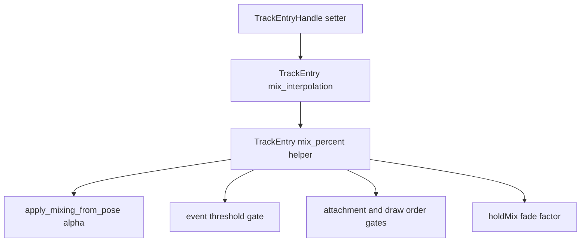

# feat: Align TrackEntry mix interpolation

> Superseded on 2026-06-23. Local `repo-ref/spine-runtimes/spine-cpp/include/spine/AnimationState.h` and `repo-ref/spine-runtimes/spine-cpp/src/spine/AnimationState.cpp` have no `MixInterpolation`, `setMixInterpolation`, or `TrackEntry::mix()` interpolation API at the active baseline. Commit `2f7dcb4` removed the Rust-only extension and returned mix percentage to the official linear `mixTime / mixDuration` path.

## Summary

Implement the upstream Spine 4.3 `TrackEntry` mix interpolation semantics introduced after the previous 4.3-beta pin. The work adds Rust-side interpolation choices, routes every mix percentage consumer through the same `TrackEntry::mix()` equivalent, and locks event, attachment, draw order, and hold-mix behavior with focused tests.

---

## Problem Frame

The repository is pinned to an older 4.3-beta commit, while the current upstream 4.3 line includes runtime changes through the 2026-06-05 4.3 tags and the active `4.3` branch. Upstream `spine-cpp` added `TrackEntry::_mixInterpolation` and uses `TrackEntry::mix()` for mixing-out alpha, event thresholds, attachment thresholds, draw order thresholds, and hold-mix fade. `spine2d` currently computes `mix_time / mix_duration` directly in those paths, so non-linear mix interpolation cannot be represented and latest 4.3 behavior is not fully aligned.

---

## Requirements

- R1. `TrackEntryHandle` exposes a way to set the mix interpolation for an entry using the upstream choices `linear`, `smooth`, `slowFast`, `fastSlow`, and `circle`.
- R2. Mixing-out behavior uses the interpolated mix percentage everywhere upstream uses `TrackEntry::mix()`.
- R3. Event, attachment, draw order, and hold-mix gates observe the interpolated mix percentage rather than the raw linear ratio.
- R4. Default behavior remains linear and preserves existing tests when no mix interpolation is configured.
- R5. Tests cover at least one non-linear interpolation where the raw ratio and interpolated mix produce different observable behavior.

---

## Key Technical Decisions

- **KTD1. Model interpolation as a small Rust enum:** The official runtime uses singleton `Interpolation` objects, but a closed enum is the deeper Rust Interface for the same behavior and avoids dynamic dispatch in core animation state.
- **KTD2. Add a `TrackEntry::mix_percent()` helper:** All mix consumers should call one internal helper so future upstream interpolation changes have one Implementation location.
- **KTD3. Keep interpolation entry-local:** Mix interpolation belongs on `TrackEntry`, not `AnimationStateData`, matching upstream ownership and preserving per-transition control.
- **KTD4. Use focused unit tests before oracle refresh:** Existing oracle goldens target the old pin, so unit tests are the reliable first regression signal for this semantic change.

---

## High-Level Technical Design

---

## Scope Boundaries

### In Scope

- Add the mix interpolation type and setter/getter surface needed by runtime users and tests.
- Replace raw mix ratio use in `AnimationState` paths that correspond to upstream `TrackEntry::mix()`.
- Add regression tests using synthetic skeleton data so the expected values are deterministic.

### Deferred to Follow-Up Work

- Refresh `assets/spine-runtimes` to a latest 4.3 tag or branch commit.
- Re-record C++ pose/render oracle goldens.
- Create a baseline manifest Module or data-driven oracle scenario manifest.
- Implement broader `TimelineSemantics` Module consolidation.

---

## Sources & Research

- Upstream latest tag scan: 4.3 has no current general `4.3.x` repository tag; latest 4.3 tag refs are runtime-specific, including `spine-flutter-4.3.4` and `spine-libgdx-4.3.2` from 2026-06-05.
- Upstream reference: `spine-cpp/include/spine/AnimationState.h` and `spine-cpp/src/spine/AnimationState.cpp` at `spine-flutter-4.3.4`, especially `TrackEntry::setMixInterpolation`, `TrackEntry::mix()`, and `AnimationState::applyMixingFrom`.
- Upstream implementation source: `spine-cpp/include/spine/Interpolation.h` and `spine-cpp/src/spine/Interpolation.cpp` at `spine-flutter-4.3.4`.
- Local references: `spine2d/src/runtime/animation_state.rs`, `spine2d/src/runtime/animation_state_mixing_semantics_tests.rs`, and `spine2d/src/runtime/animation_state_tests.rs`.

---

## Implementation Units

### U1. Add TrackEntry mix interpolation model

**Goal:** Add the Rust representation of upstream mix interpolation and wire it into track entry creation and mutation.

**Requirements:** R1, R4.

**Dependencies:** None.

**Files:** `spine2d/src/runtime/animation_state.rs`, `spine2d/src/runtime/mod.rs`, `spine2d/src/lib.rs`.

**Approach:** Define a public `MixInterpolation` enum near the runtime animation-state types, default it to `Linear`, store it on `TrackEntry`, reset it through normal entry creation, and expose a setter through `TrackEntryHandle`. Implement the five upstream formulas exactly enough for deterministic tests.

**Execution note:** Implement the enum and tests together only after confirming the intended formulas from upstream `Interpolation.cpp`.

**Patterns to follow:** Existing `MixBlend`, `MixDirection`, and `TrackEntryHandle` setter patterns in `spine2d/src/runtime/animation_state.rs`.

**Test scenarios:**

- Happy path: a new `TrackEntry` defaults to linear interpolation and an existing linear mix test keeps the same pose value at half mix.
- Happy path: setting `FastSlow` on a queued or replacement entry changes the computed mix from raw `0.5` to `0.75`.
- Edge case: `mix_duration == 0` returns `1.0` regardless of interpolation choice.
- Edge case: interpolation output is clamped to `[0, 1]` for non-linear choices.

**Verification:** Public exports compile, existing animation-state tests pass, and a direct behavior test can observe a non-linear mix effect.

### U2. Route AnimationState mix consumers through interpolated mix

**Goal:** Replace raw mix ratio calculations with the `TrackEntry` mix helper in all paths that upstream routes through `TrackEntry::mix()`.

**Requirements:** R2, R3, R4.

**Dependencies:** U1.

**Files:** `spine2d/src/runtime/animation_state.rs`, `spine2d/src/runtime/animation_state_mixing_semantics_tests.rs`, `spine2d/src/runtime/animation_state_tests.rs`.

**Approach:** Use the helper in `apply_mixing_from_pose`, hold-mix factor calculation, event threshold gating, and any local alpha or threshold calculation that semantically mirrors upstream `TrackEntry::mix()`. Keep update/disposal timing based on raw `mix_time >= mix_duration`, matching upstream completion logic.

**Patterns to follow:** Existing `apply_mixing_from_pose` threshold tests and upstream `AnimationState::applyMixingFrom` at `spine-flutter-4.3.4`.

**Test scenarios:**

- Happy path: `FastSlow` interpolation at raw half mix fades an outgoing translate timeline as if mix is `0.75`, not `0.5`.
- Happy path: `SlowFast` interpolation at raw half mix allows outgoing events with a threshold between `0.25` and `0.5`, while linear does not.
- Edge case: attachment and draw order thresholds use interpolated mix, so a threshold between raw and interpolated values flips application.
- Integration scenario: a hold-mix chain uses the held entry's interpolated mix for the fade factor.

**Verification:** New tests fail before replacing raw ratio calls and pass after the helper is used consistently.

### U3. Run targeted latest-upstream parity checks

**Goal:** Confirm the mix interpolation change does not regress existing smoke behavior against the latest local upstream checkout.

**Requirements:** R4, R5.

**Dependencies:** U1, U2.

**Files:** `spine2d/src/runtime/animation_state_mixing_semantics_tests.rs`, `spine2d/src/runtime/animation_state_tests.rs`.

**Approach:** Use existing test infrastructure and the local `.cache/spine-runtimes/examples` checkout for latest 4.3 smoke. Do not refresh committed assets or goldens in this unit.

**Patterns to follow:** Existing `upstream_examples_tests_scope_*` smoke tests and documented `cargo nextest` preference.

**Test scenarios:**

- Integration scenario: latest local upstream JSON examples pass `upstream_examples_tests_scope_json_sample_smoke_all_examples`.
- Integration scenario: latest local upstream `.skel` examples pass `upstream_examples_tests_scope_skel_sample_smoke_all_examples`.
- Regression scenario: focused mix interpolation tests pass with `cargo nextest`.

**Verification:** Targeted nextest runs pass with `--features json,binary,upstream-smoke` using `SPINE2D_UPSTREAM_EXAMPLES_DIR` pointed at `.cache/spine-runtimes/examples`.

---

## Risks & Dependencies

- **Public API naming:** `MixInterpolation` becomes part of the runtime API; naming should stay close to upstream without copying the C++ object model.
- **Threshold sensitivity:** Event, attachment, and draw order tests may need precise raw mix times to avoid floating-point ambiguity around threshold equality.
- **Oracle baseline drift:** Existing oracle goldens still represent the old upstream pin, so oracle failures after a future baseline refresh should be judged separately from this unit.

---

## System-Wide Impact

This changes animation mixing semantics for any user who opts into non-linear mix interpolation. Default linear behavior should remain unchanged, but the internal helper reduces the chance that future mix semantics diverge across AnimationState paths.
