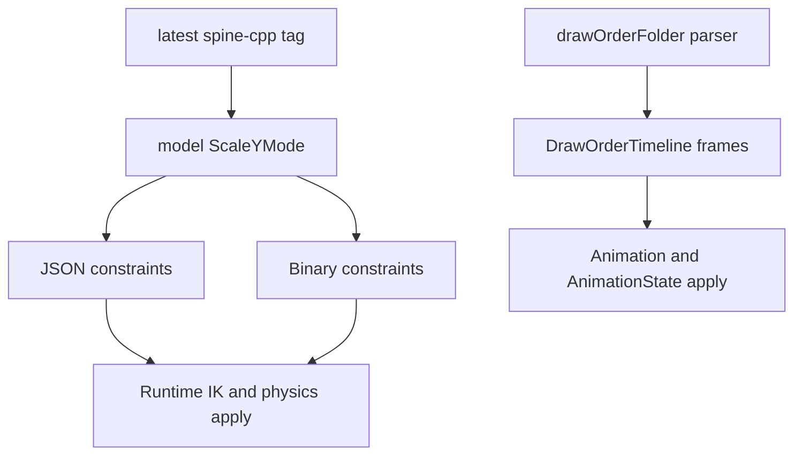

# fix: Align latest Spine 4.3 runtime parsing

## Summary

Align the first batch of `spine2d` runtime behavior with the latest reproducible upstream tag baseline, `spine-flutter-4.3.4` at commit `80dc680a4345ac09cdc5d4c1a77ec572a3f295d1` from 2026-06-05. This batch targets confirmed `spine-cpp` deltas in constraint `scaleY` mode, binary path flags, and `drawOrderFolder` timelines.

---

## Problem Frame

The previous implementation tracks an older 4.3 development baseline. Latest upstream `spine-cpp` no longer encodes IK scale behavior as a `uniform` bool, adds `ScaleYMode` to IK and physics constraints, decodes binary path `positionMode` differently, and supports `drawOrderFolder` timelines. These are behavior surfaces, not compatibility niceties, so stale parsing silently produces wrong poses or misaligned binary animation streams.

---

## Requirements

- R1. IK constraints expose and apply upstream `ScaleYMode` values `none`, `uniform`, and `volume` instead of the stale `uniform` bool.
- R2. Physics constraints parse and apply upstream `ScaleYMode`, including binary negative `scaleX` sentinel encoding.
- R3. Binary path constraints decode `positionMode` using latest upstream `((flags >> 1) & 1)` semantics.
- R4. JSON and binary animations parse `drawOrderFolder` timelines and apply folder-local ordering without disturbing slots outside the folder.
- R5. Regression tests lock the new parser and runtime behavior before oracle/golden refresh work.

---

## Key Technical Decisions

- **KTD1. Replace stale bool semantics in the model:** `ScaleYMode` is the upstream concept and should live in `model.rs` so JSON, binary, and runtime share one Interface.
- **KTD2. Model draw-order folder as a separate timeline:** Upstream applies folder timelines to the current draw order and only replaces slots that belong to the folder, so preserving that locality is more accurate than pre-expanding to a global setup order.
- **KTD3. Keep latest tag explicit:** Use `spine-flutter-4.3.4` as the reproducible latest-tag baseline for this batch, while documenting that it is a runtime-specific tag rather than a whole-repo generic `4.3.x` tag.
- **KTD4. Defer broad timeline-semantics consolidation:** `TimelineSemantics` is the deeper Module direction, but this fix first creates green behavior signals around the changed upstream surface.

---

## High-Level Technical Design

---

## Implementation Units

### U1. Add shared `ScaleYMode`

**Goal:** Replace the stale IK `uniform` field with a shared upstream scale mode used by IK and physics data.

**Requirements:** R1, R2.

**Dependencies:** None.

**Files:** `spine2d/src/model.rs`, `spine2d/src/runtime/skeleton.rs`, `spine2d/src/binary_tests.rs`.

**Approach:** Add `ScaleYMode` with upstream numeric order `None = 0`, `Uniform = 1`, `Volume = 2`. Store it on `IkConstraintData`, `PhysicsConstraintData`, and runtime `IkConstraint`; update setup-pose reset and comparison tests to use the enum.

**Execution note:** Start with parser/model tests that fail on the old `uniform` field before changing runtime application.

**Patterns to follow:** Existing model enums such as `PositionMode`; existing setup reset in `Skeleton::set_slots_to_setup_pose`.

**Test scenarios:**

- Happy path: JSON IK `scaleY: "uniform"` parses to `ScaleYMode::Uniform`.
- Happy path: JSON IK `scaleY: "volume"` parses to `ScaleYMode::Volume`.
- Edge case: omitted or unknown JSON `scaleY` maps to `ScaleYMode::None`, matching upstream `ScaleYMode_valueOf`.
- Happy path: physics JSON `scaleY` uses the same enum.

**Verification:** Focused JSON tests compile without a `uniform` model field and pass.

### U2. Align binary constraint decoding

**Goal:** Decode latest `.skel` IK, physics, and path constraint flags exactly enough to keep the binary cursor and setup data aligned.

**Requirements:** R1, R2, R3.

**Dependencies:** U1.

**Files:** `spine2d/src/binary.rs`, `spine2d/src/binary_tests.rs`.

**Approach:** For IK, treat `flags & 2` as a following `ScaleYMode` byte. For physics, decode negative `scaleX` sentinel values into `ScaleYMode::Uniform` and `ScaleYMode::Volume`. For path constraints, change `positionMode` to `((flags >> 1) & 1)`.

**Patterns to follow:** Existing `map_*` binary helpers and upstream `SkeletonBinary.cpp` at `spine-flutter-4.3.4`.

**Test scenarios:**

- Happy path: path flags with bit 1 set decode `Percent`.
- Regression path: path flags with only bit 2 set no longer decode as `Percent`.
- Happy path: IK flags with `flags & 2` consume a mode byte and store `Uniform`.
- Happy path: physics encoded `scaleX = -1.25` stores `ScaleYMode::Uniform` and `scale_x = 0.25`.
- Happy path: physics encoded `scaleX = -2.25` stores `ScaleYMode::Volume` and `scale_x = 0.25`.

**Verification:** Binary unit tests exercise the helper-level decode behavior without needing a full fixture export.

### U3. Apply `ScaleYMode` at runtime

**Goal:** Make IK stretch/compress and physics scale application match upstream `uniform` and `volume` behavior.

**Requirements:** R1, R2.

**Dependencies:** U1, U2.

**Files:** `spine2d/src/runtime/skeleton.rs`, `spine2d/src/runtime/ik_tests.rs`, `spine2d/src/json_physics_defaults_tests.rs`.

**Approach:** Route IK apply functions through `ScaleYMode`; `Uniform` scales Y with X and `Volume` applies the upstream reciprocal-volume curve. Physics scale should update the bone matrix Y column for `Uniform` and `Volume` the same way upstream `PhysicsConstraint::update` does.

**Patterns to follow:** Existing IK stretch/compress code and upstream `IkConstraint.cpp` / `PhysicsConstraint.cpp`.

**Test scenarios:**

- Happy path: one-bone IK stretch with `Uniform` changes setup scale Y by the same factor as scale X.
- Happy path: one-bone IK stretch with `Volume` reduces scale Y using the upstream volume formula.
- Edge case: one-bone IK stretch with `None` leaves scale Y unchanged.
- Integration scenario: physics scale with `Uniform` scales both world matrix columns when scale is applied.

**Verification:** Runtime unit tests cover observable scale differences between the three modes.

### U4. Parse and apply `drawOrderFolder`

**Goal:** Support the latest upstream folder-local draw order timeline in JSON and binary animations.

**Requirements:** R4, R5.

**Dependencies:** None.

**Files:** `spine2d/src/model.rs`, `spine2d/src/json.rs`, `spine2d/src/binary.rs`, `spine2d/src/runtime/animation.rs`, `spine2d/src/runtime/animation_state.rs`, `spine2d/src/runtime/slot_timeline_tests.rs`.

**Approach:** Add a dedicated draw-order folder timeline containing setup slot indices for the folder and per-frame indices into that folder. JSON reads `drawOrderFolder.*.slots` plus `keys`; binary reads the folder section after normal draw order and before events. Runtime applies every folder timeline after the ordinary draw-order timeline and only rewrites current draw-order positions whose slot belongs to the folder.

**Patterns to follow:** Existing `build_draw_order_to_setup_index`, `apply_draw_order`, and upstream `DrawOrderFolderTimeline` parser placement.

**Test scenarios:**

- Happy path: JSON folder with slots `[b, c]` reorders only those slots and leaves `a` outside the folder untouched.
- Edge case: empty folder key resets the folder portion to setup order while preserving outside slots.
- Error path: JSON folder references an unknown slot and returns the existing draw-order parse error shape.
- Integration scenario: `AnimationState` applies a folder draw-order timeline under normal draw-order threshold gating.

**Verification:** Targeted slot timeline tests pass with `--features json`.

---

## Scope Boundaries

- This plan does not implement stale development-branch `TrackEntry::additive`, `keepHold`, or `mixInterpolation` assumptions. Current TrackEntry parity is tracked in `docs/plans/2026-06-23-001-refactor-spine-cpp-parity-hardening-plan.md` and follows the local C++ `mixBlend` / `holdPrevious` surface instead.
- This plan does not re-record oracle pose/render goldens.
- This plan does not introduce the larger `TimelineSemantics` or `SkeletonDataBuilder` Module refactors, though the changed code should not block those follow-ups.

### Deferred to Follow-Up Work

- Create a single upstream baseline manifest Module so docs, import scripts, and oracle scripts stop duplicating the baseline pin.
- Convert oracle scenarios from Rust-source regex discovery to a data manifest.
- Deepen timeline property IDs and apply order into a `TimelineSemantics` Module.

---

## Risks & Dependencies

- `drawOrderFolder` composition can interact with AnimationState draw-order threshold gating; tests must cover plain `Animation::apply` and `AnimationState::apply`.
- Latest upstream has additional `AnimationState` semantic changes, so oracle failures after this batch may still be unrelated to these parser fixes.
- Existing docs disagree on whether the baseline should be latest tag or latest `4.3` branch commit; this plan uses the user-requested latest tag for behavior comparison.

---

## Sources / Research

- `spine-cpp/src/spine/SkeletonJson.cpp` at `spine-flutter-4.3.4`: IK and physics `scaleY`, plus `drawOrderFolder` parsing.
- `spine-cpp/src/spine/SkeletonBinary.cpp` at `spine-flutter-4.3.4`: IK `ScaleYMode` byte, physics `scaleX` sentinel, path `positionMode`, and binary draw-order folder section placement.
- `spine-cpp/include/spine/ConstraintData.h` at `spine-flutter-4.3.4`: `ScaleYMode` enum values and string mapping.
- `spine-cpp/src/spine/IkConstraint.cpp` and `PhysicsConstraint.cpp` at `spine-flutter-4.3.4`: runtime `Uniform` and `Volume` scale application.
