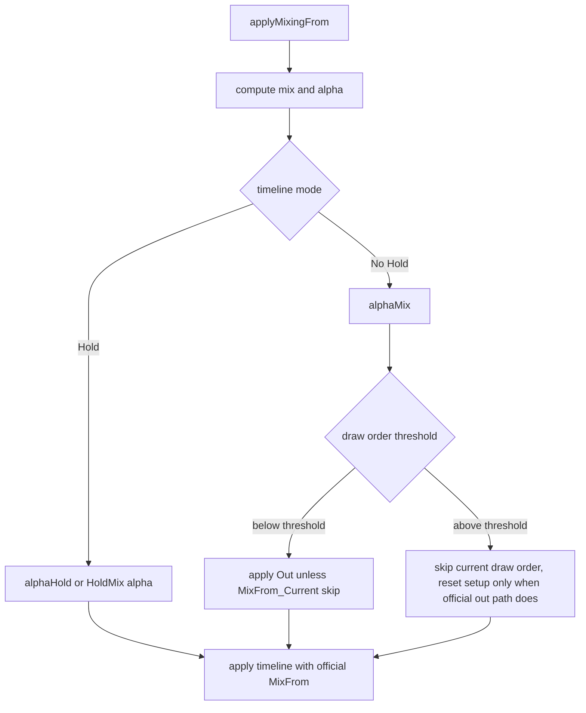

# fix: Align mixing-from thresholds

## Summary

Align the remaining `applyMixingFrom` threshold behavior with latest tagged spine-cpp. The first slice targets draw order threshold handling, then reclassifies additive-to-empty and HoldMix drift from the updated failure set.

---

## Problem Frame

The runtime is pinned to the latest visible `EsotericSoftware/spine-runtimes` tag, `spine-flutter-4.3.4` at `80dc680a4345ac09cdc5d4c1a77ec572a3f295d1`. After plans 011-013, upstream-smoke failures concentrate in `applyMixingFrom`: draw order thresholds, attachment thresholds, HoldMix, and additive-to-empty numeric drift.

---

## Requirements

- R1. `mixDrawOrderThreshold` must match spine-cpp when a mixing-from draw order timeline is below threshold, above threshold, or using `MixFrom_Current`.
- R2. `mixAttachmentThreshold` must keep the official retain/setup behavior for attachment timelines during chained mixes.
- R3. HoldMix alpha must fade held timelines using the same target entry mix as spine-cpp.
- R4. Additive-to-empty scenarios must use official additive timeline math without broad legacy entry-level blend shortcuts.
- R5. Core `json,binary` tests must remain green, and upstream-smoke failures must shrink or be reclassified with concrete causes.

---

## Key Technical Decisions

- **Mirror spine-cpp control flow before tuning data tolerances:** Remaining failures are clustered around branch behavior, not parser output. Fix `applyMixingFrom` branching first, then inspect numeric drift.
- **Keep breakage over compatibility shims:** Latest tag has no public `mixBlend` or `holdPrevious`; this plan continues the direct latest-runtime surface.
- **Use oracle scenarios as the interface:** The deepest verification seam is the existing C++ oracle comparison, so fixes should be validated through named upstream-smoke scenarios rather than isolated golden guesses.

---

## High-Level Technical Design

---

## Implementation Units

### U1. Align draw order threshold branching

- **Goal:** Make mixing-from draw order timelines follow spine-cpp's `drawOrder`, `MixFrom_Current`, and `out` decisions.
- **Requirements:** R1, R5.
- **Dependencies:** None.
- **Files:** `spine2d/src/runtime/animation_state.rs`, `spine2d/src/runtime/oracle_scenario_parity_tests.rs`.
- **Approach:** In `apply_mixing_from_pose`, skip draw order timelines when the official branch would `continue`, and pass `MixDirection::Out` only when spine-cpp's `out` argument is true. Avoid using `timeline_blend == Setup` as a proxy for threshold semantics.
- **Patterns to follow:** `.cache/spine-runtimes/spine-cpp/src/spine/AnimationState.cpp` around `applyMixingFrom`.
- **Test scenarios:** Tank `shoot_to_shoot_mixDrawOrderThreshold_0/1`, tank `drive + shoot add -> shoot` draw order threshold, and both JSON/SKEL variants must match C++ or expose a smaller next failure.
- **Verification:** Target upstream-smoke draw order tests pass or produce a narrower non-draw-order diff; core `json,binary` tests remain green.

### U2. Recheck attachment threshold retain behavior

- **Goal:** Confirm or fix attachment threshold behavior after draw order branching no longer pollutes tank scenario diffs.
- **Requirements:** R2, R5.
- **Dependencies:** U1.
- **Files:** `spine2d/src/runtime/animation_state.rs`, `spine2d/src/runtime/animation.rs`, `spine2d/src/runtime/oracle_scenario_parity_tests.rs`.
- **Approach:** Compare Rust `apply_attachment` calls against spine-cpp `applyAttachmentTimeline`, especially the `retainAttachments && alpha >= alphaAttachmentThreshold` condition.
- **Patterns to follow:** Plans 012 and 013; upstream `applyAttachmentTimeline`.
- **Test scenarios:** Tank `drive_t2_shoot_add_alpha0_5_t1_shoot_to_shoot_mixAttachmentThreshold_0/1` in JSON/SKEL.
- **Verification:** Attachment threshold scenarios pass or their diffs are isolated to non-attachment properties.

### U3. Recheck HoldMix alpha semantics

- **Goal:** Match spine-cpp when a held timeline fades through `timelineHoldMix`.
- **Requirements:** R3, R5.
- **Dependencies:** U1, U2.
- **Files:** `spine2d/src/runtime/animation_state.rs`, `spine2d/src/runtime/oracle_scenario_parity_tests.rs`.
- **Approach:** Verify that Rust uses `alphaHold * (1 - holdMix.mix())` with the same holdMix entry chosen by `compute_hold`, including additive timelines that should not hold.
- **Patterns to follow:** Upstream `computeHold` and `applyMixingFrom`.
- **Test scenarios:** `tank_shoot_to_shoot_to_drive_holdMix_smoke_glow_t0_2` in JSON/SKEL.
- **Verification:** HoldMix scenarios match C++ or identify the first differing timeline mode.

### U4. Reclassify additive-to-empty numeric drift

- **Goal:** Determine whether additive-to-empty failures are still branch bugs or true numeric/tolerance drift after threshold fixes.
- **Requirements:** R4, R5.
- **Dependencies:** U1, U2, U3.
- **Files:** `spine2d/src/runtime/animation_state.rs`, `spine2d/src/runtime/animation.rs`, `spine2d/src/runtime/oracle_scenario_parity_tests.rs`.
- **Approach:** Start from the smallest diamond additive scenario, then alien add-to-empty. Compare final pose fields against C++ to identify whether blend mode, alpha, or timeline additive flags differ.
- **Patterns to follow:** Upstream timeline `getAdditive()` and `TrackEntry::_additive` application paths.
- **Test scenarios:** Diamond `idle_rotating + idle_still add`, diamond `add -> empty`, alien `run + death add -> empty`, JSON/SKEL variants.
- **Verification:** Additive-to-empty failures pass or become the next focused plan with exact first-diff evidence.

---

## Risks & Dependencies

- The working tree is intentionally dirty from prior parity work and regenerated goldens. This plan must not revert or stage unrelated user changes.
- `@esotericsoftware/spine-core` package metadata may show newer package versions, but GitHub tag discovery currently reports `spine-flutter-4.3.4` as the latest `spine-runtimes` repository tag.

---

## Sources / Research

- `spine-upstream.toml` records latest tag pin `spine-flutter-4.3.4` at `80dc680a4345ac09cdc5d4c1a77ec572a3f295d1`.
- `.cache/spine-runtimes/spine-cpp/src/spine/AnimationState.cpp` defines `applyMixingFrom`, `computeHold`, and `applyAttachmentTimeline` behavior used as the oracle.
- `spine2d/src/runtime/animation_state.rs` holds the Rust `AnimationState` implementation.
- `spine2d/src/runtime/oracle_scenario_parity_tests.rs` holds the C++ oracle comparison scenarios.
