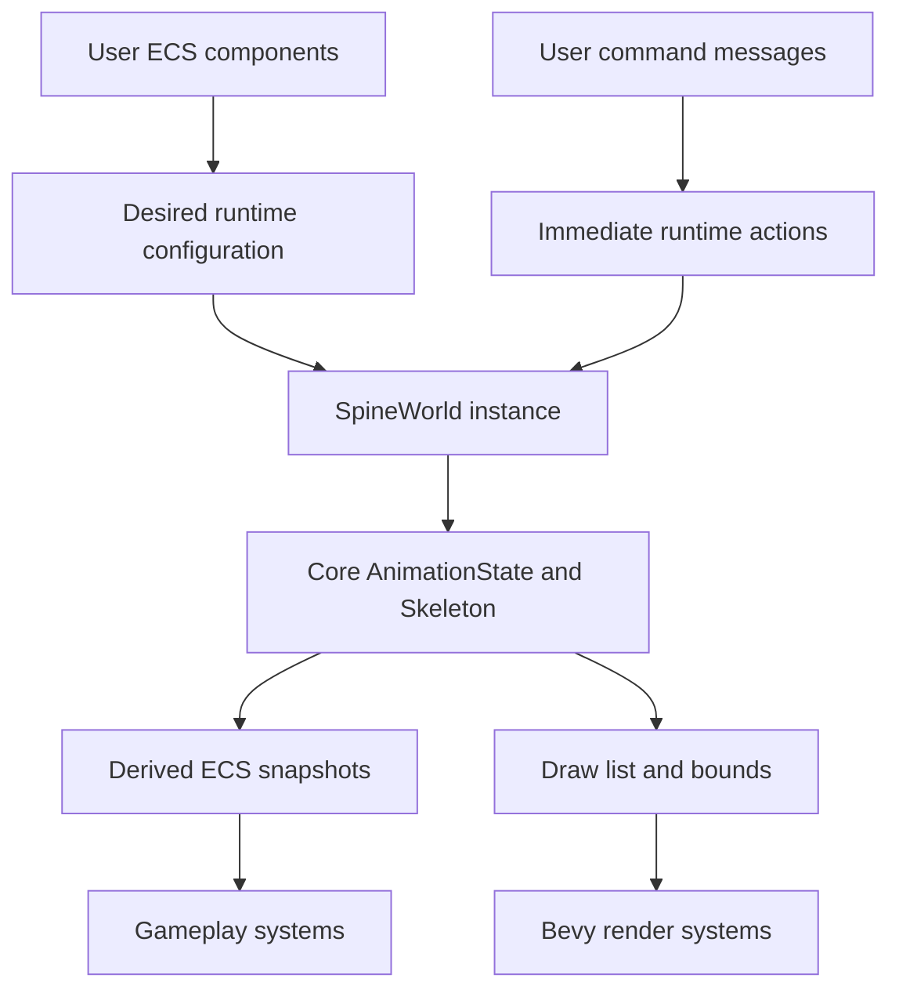
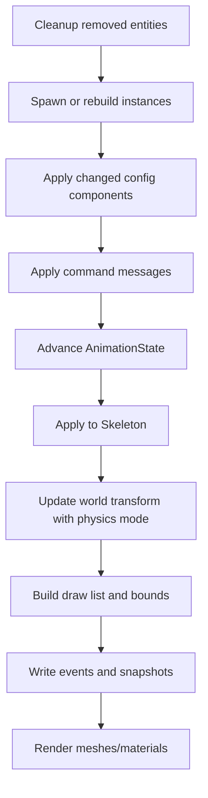
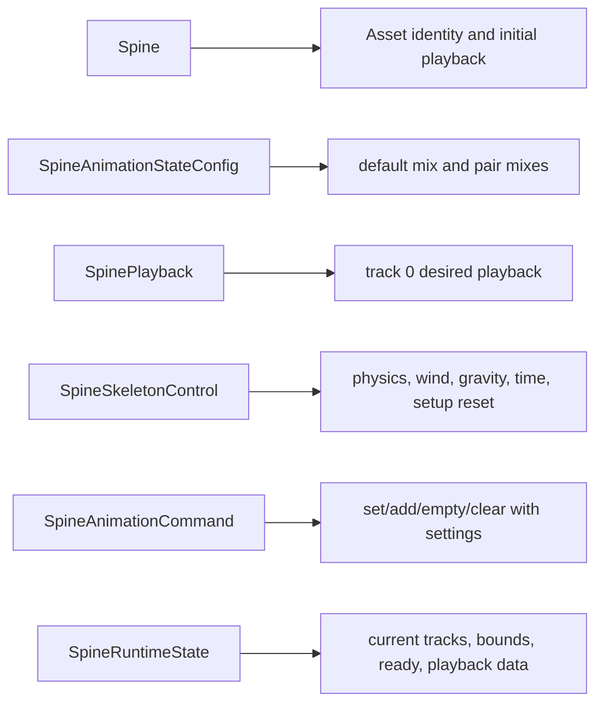

# refactor: Rebuild Bevy runtime control surface

## Summary

Rebuild `spine2d-bevy` around a future-facing runtime control model instead of adding one-off command helpers. The refactor first tightens the core `spine2d` control API, then exposes Bevy-native components, commands, snapshots, and documentation for animation mixes, track-entry settings, physics/update modes, setup-pose resets, and runtime state observation.

---

## Problem Frame

GitHub issue #4 reports that Bevy users cannot configure animation mixes because the runtime instance is private and `set_mix` is not visible through the backend. The immediate fix is small, but the same shape repeats across the backend: the core runtime already owns many official Spine control surfaces, while `spine2d-bevy` exposes only a narrow subset through `SpineAnimation`, `SpineSkin`, `SpineAnimationCommand`, events, and bounds.

The project is still early enough to break public API. That should be used to make the backend correct as a long-lived engine integration: core runtime behavior stays renderer-agnostic and close to official Spine 4.3 semantics, while Bevy gets an ECS-first control surface that does not leak internal runtime handles or force users into crate-private access.

---

## Requirements

**Core runtime API**

- R1. `AnimationStateData` exposes the official mix-configuration API shape for default mix, name-based pair mix assignment, animation-reference pair lookup, and clearing all mixes.
- R2. `AnimationState` exposes official-style empty-animation convenience where missing, including applying empty animations across active tracks.
- R3. `TrackEntry` configuration remains reachable through safe Rust ownership rules and supports every public per-entry control already implemented in core runtime.
- R4. `Skeleton` runtime controls needed by backends are explicit and documented: physics update mode, wind, gravity, time, setup pose, and reset/update ordering.

**Bevy backend control surface**

- R5. Bevy users can configure mix settings at spawn time and at runtime without accessing `SpineWorld` or core runtime internals.
- R6. Bevy users can configure per-entry settings when setting or queueing animations, including empty animations, without receiving a raw `TrackEntryHandle`.
- R7. Bevy users can control physics mode, wind, gravity, skeleton time, and setup-pose reset through components or commands that fit Bevy schedules.
- R8. Bevy users can observe current runtime state through read-only ECS data instead of relying only on fire-and-forget events.
- R9. Component-driven changes and command-driven changes have clear precedence and do not silently diverge.

**Quality and migration**

- R10. The public Bevy API is allowed to break, but the replacement API must be internally coherent and documented with migration notes.
- R11. Tests cover spawn-time configuration, runtime command configuration, changed-component configuration, per-track entry settings, physics/update behavior, setup resets, and snapshots.
- R12. Examples and README material show the intended high-level backend API, not crate-private escape hatches.

---

## Key Technical Decisions

- KTD1. **Break toward a cohesive backend API:** Replace the current accumulation of narrow helpers with grouped Bevy types for animation state data, track-entry settings, skeleton controls, and state snapshots. This makes future backend features additive rather than another round of ad hoc commands.
- KTD2. **Keep core runtime as the source of truth:** Add or clean missing core APIs before wrapping them in Bevy. The backend should not duplicate validation or semantics that belong to `spine2d`.
- KTD3. **Use value-object settings for TrackEntry configuration:** Bevy commands should carry a `TrackEntry` settings object and apply it immediately to the returned core handle. Bevy systems should not store raw `TrackEntryHandle` values across frames because handles become stale when entries are disposed.
- KTD4. **Separate persistent configuration from one-shot commands:** Components describe durable desired state; messages describe immediate actions. Changed components are re-applied predictably, while commands retain their current event-like behavior.
- KTD5. **Expose snapshots, not internals:** Publish read-only ECS state derived from the runtime after update. This gives gameplay systems visibility into tracks, queued entries, physics mode, bounds, and ready state without making `SpineWorld` public.
- KTD6. **Make physics an explicit backend concern:** `spine2d-bevy` should default to current behavior for non-physics assets, but offer first-class `Physics::Update`, `Physics::Pose`, and `Physics::Reset` control for assets that need official physics semantics.
- KTD7. **Document the migration as a new API generation:** Because the crate has few users, the plan favors correct naming, grouping, and schedule behavior over preserving temporary names from the first backend surface.

---

## High-Level Technical Design

### Control Model

### Per-Frame Lifecycle

### API Shape

---

## Scope Boundaries

### In Scope

- Breaking public API redesign for `spine2d-bevy` runtime controls.
- Core `spine2d` API cleanup needed to support backend controls without duplicating semantics.
- Focused tests for Bevy ECS behavior and core API validation.
- README, example, and migration-note updates for the new control model.

### Deferred to Follow-Up Work

- Public mutable access to `SpineWorld` or raw runtime instances from Bevy systems.
- A Bevy editor UI or inspector panel for every control.
- Large visual redesign of `spine2d-bevy/examples/viewer.rs`.
- New rendering features, batching changes, or material pipeline changes unrelated to runtime controls.
- Re-recording upstream oracle goldens unless core behavior changes unexpectedly during implementation.

### Outside This Plan

- Supporting older Spine export versions.
- Adding FFI or bindings to official runtimes.
- Making `spine2d-bevy` a generic reflection layer over every core runtime field.

---

## Implementation Units

### U1. Clean core AnimationStateData control API

**Goal:** Make mix configuration a complete core runtime API before Bevy wraps it.

**Requirements:** R1, R5, R10.

**Dependencies:** None.

**Files:** `spine2d/src/runtime/animation_state.rs`, `spine2d/src/runtime/animation_state_tests.rs`, `spine2d/src/runtime/mod.rs`, `spine2d/src/lib.rs`.

**Approach:** Expose default mix and official mix setters/getters without Rust-only validation or removal APIs. Name-based setters assert on missing animation names like the latest C++ name overloads; animation-reference accessors return direct values and mix storage follows official animation-name pair equality.

**Patterns to follow:** Current `AnimationStateData::set_mix`, `set_mix_animation`, `get_mix`, and `clear` behavior plus the `TrackEntryHandle` public API style in `spine2d/src/runtime/animation_state.rs`.

**Test scenarios:**

- Happy path: setting default mix changes the mix duration for transitions without a pair override.
- Happy path: setting a pair mix overrides default mix for a known animation pair.
- Edge case: querying a missing animation-reference pair returns the default mix.
- Error path: unknown animation names panic/assert like C++ name overloads.
- Direct-assignment path: negative, NaN, and infinite durations are stored directly like C++.
- Regression path: existing animation-state tests keep their behavior when no mix settings are configured.

**Verification:** Core API compiles from the crate root, focused tests prove direct C++-style mix behavior, and existing `spine2d` animation-state tests remain green.

### U2. Fill missing core runtime convenience controls

**Goal:** Add official-style control helpers that backends naturally need, without forcing Bevy to synthesize them.

**Requirements:** R2, R3, R4, R10.

**Dependencies:** U1.

**Files:** `spine2d/src/runtime/animation_state.rs`, `spine2d/src/runtime/animation_state_tests.rs`, `spine2d/src/runtime/skeleton.rs`, `spine2d/src/runtime/skeleton_tests.rs`.

**Approach:** Add missing convenience operations such as setting empty animations across tracks and any missing TrackEntry setters already supported internally. Review skeleton controls and expose explicit methods where public fields are currently the only path.

**Patterns to follow:** Current local C++ TrackEntry evidence, the core `TrackEntrySettings` value object, and prior cleanup slices that removed Rust-only TrackEntry controls when no matching C++ surface exists.

**Test scenarios:**

- Happy path: setting empty animations across active tracks queues or applies empty entries with the requested mix duration.
- Edge case: empty-animation helpers are no-ops on absent tracks but preserve event ordering on active tracks.
- Happy path: new skeleton control methods update the same runtime fields currently used by physics and world-transform code.
- Error path: invalid finite-value inputs are rejected or ignored consistently with existing `Skeleton::set_wind`, `Skeleton::set_gravity`, and `Skeleton::set_time`.

**Verification:** The backend can call all needed core controls through public API, and no Bevy unit needs crate-private runtime access to implement user controls.

### U3. Replace Bevy mix surface with state-data configuration

**Goal:** Convert the current `SpineAnimationMixes` patch into the planned long-term animation-state configuration model.

**Requirements:** R5, R9, R10, R11, R12.

**Dependencies:** U1.

**Files:** `spine2d-bevy/src/components.rs`, `spine2d-bevy/src/systems.rs`, `spine2d-bevy/src/lib.rs`, `spine2d-bevy/src/spine_world.rs`, `README.md`.

**Approach:** Introduce a named state-data configuration component that owns default mix and pair mixes. Apply it during spawn and on `Changed` after the instance exists. Keep runtime mix commands for immediate changes, but route both component and command paths through one backend helper that calls the core API.

**Patterns to follow:** Existing spawn-time component fallback for `SpineAnimation` and `SpineSkin`, plus current tests for mix settings added around issue #4.

**Test scenarios:**

- Happy path: spawn-time state-data config sets default mix and a pair mix before initial playback is started.
- Happy path: changing the config component after spawn updates the existing runtime instance before the next animation transition.
- Happy path: runtime commands update default mix and pair mix on an existing instance.
- Precedence scenario: if a changed component and command both target mix settings in the same frame, the documented schedule order determines the final runtime value.
- Direct-assignment path: invalid-looking mix durations are forwarded to core runtime without Bevy-side validation, matching C++ direct assignment.
- Error path: unknown animation names panic through the core runtime name overloads instead of being converted into Bevy warnings.

**Verification:** `spine2d-bevy` tests prove spawn, changed-component, command, and conflict-order behavior.

### U4. Redesign animation commands around TrackEntry settings

**Goal:** Let Bevy users configure every useful per-entry option when setting or queueing animations.

**Requirements:** R3, R6, R9, R10, R11, R12.

**Dependencies:** U2, U3.

**Files:** `spine2d-bevy/src/components.rs`, `spine2d-bevy/src/systems.rs`, `spine2d-bevy/src/spine_world.rs`, `spine2d-bevy/examples/basic.rs`, `spine2d-bevy/examples/multi_spine.rs`, `README.md`.

**Approach:** Replace narrow command constructors with a command model that can carry optional `SpineTrackEntrySettings`. Apply settings immediately to the `TrackEntryHandle` returned by core `set`, `add`, `set_empty`, and `add_empty`. Include alpha, additive, mix interpolation, reverse, shortest rotation, mix duration, track end, delay, animation start/end/last, and threshold controls.

**Patterns to follow:** Core `TrackEntryHandle` setter list and the existing Bevy command tests for set/add/clear behavior.

**Test scenarios:**

- Happy path: a set-animation command with alpha, additive, and mix interpolation produces a current entry whose fields match the settings.
- Happy path: an add-animation command with delay and mix duration applies both to the queued entry.
- Happy path: empty-animation commands accept track-entry settings where they make sense and preserve empty-animation track end semantics.
- Edge case: reset rotation directions can be requested on the returned entry without needing persistent handles.
- Error path: settings on a missing-animation command are not applied to any prior entry before the core panic/assert boundary is reached.
- Integration scenario: a queued entry with event threshold emits outgoing events according to the configured threshold after the transition begins.

**Verification:** Tests read runtime state through test-only access or the new snapshot path and prove settings land on the correct entry.

### U5. Add Bevy skeleton and physics controls

**Goal:** Expose skeleton-level runtime controls needed by official Spine physics and setup-pose workflows.

**Requirements:** R4, R7, R9, R10, R11, R12.

**Dependencies:** U2.

**Files:** `spine2d-bevy/src/components.rs`, `spine2d-bevy/src/systems.rs`, `spine2d-bevy/src/spine_world.rs`, `spine2d-bevy/examples/viewer.rs`, `README.md`.

**Approach:** Add a durable skeleton-control component plus commands for one-shot resets. Store the current physics mode and world-control values in `SpineInstance`, use them when rebuilding pose, and call `update_world_transform_with_physics` rather than the current physics-free update path.

**Patterns to follow:** Core `Skeleton::set_wind`, `Skeleton::set_gravity`, `Skeleton::set_time`, `Skeleton::setup_pose`, and `Skeleton::update_world_transform_with_physics`.

**Test scenarios:**

- Happy path: physics mode `Update` is used when rebuilding pose for an entity with skeleton controls.
- Happy path: changing wind or gravity updates the core skeleton before world transform is recalculated.
- Happy path: setting skeleton time through a component or command changes `Skeleton::time`.
- One-shot scenario: setup-pose reset clears animated pose state, then the next update reapplies current animation from `AnimationState`.
- Edge case: `Physics::Reset` applies for the intended frame and then follows the documented persistence or one-shot behavior.
- Precedence scenario: changed skeleton-control component and reset command in the same frame resolve in documented schedule order.

**Verification:** Bevy tests assert core skeleton fields and observable pose/bounds changes without exposing runtime instances publicly.

### U6. Publish runtime state snapshots

**Goal:** Give gameplay systems read-only ECS visibility into current runtime state.

**Requirements:** R8, R9, R10, R11, R12.

**Dependencies:** U4, U5.

**Files:** `spine2d-bevy/src/components.rs`, `spine2d-bevy/src/systems.rs`, `spine2d-bevy/src/spine_world.rs`, `spine2d-bevy/examples/metadata.rs`, `README.md`.

**Approach:** Add a public snapshot component updated after animation/physics and before render. Include entity readiness, current tracks, current animation names, loop flags, track times, mix durations, skeleton time, physics mode, and bounds-adjacent values that are useful for gameplay. Keep detailed geometry and raw runtime handles out of the snapshot.

**Patterns to follow:** Existing `SpineBounds`, `SpineReady`, `SpineLifecycleEvent`, and `TrackEntrySnapshot` concepts.

**Test scenarios:**

- Happy path: a spawned entity with a current animation receives a snapshot with track 0 data.
- Happy path: queued animations update snapshot fields when they become current.
- Happy path: clearing a track removes it from the snapshot on the next update.
- Integration scenario: snapshot updates after command processing, so same-frame commands are visible to later systems in the documented set order.
- Lifecycle scenario: snapshot is removed when the runtime instance is released due to component removal, despawn, component change, or asset reload.

**Verification:** Bevy lifecycle tests assert snapshot insertion, update, and cleanup alongside `SpineReady` and `SpineBounds`.

### U7. Refactor system scheduling and helper boundaries

**Goal:** Make the backend update pipeline explicit enough to support the new control surfaces without hidden ordering bugs.

**Requirements:** R5, R6, R7, R8, R9, R10, R11.

**Dependencies:** U3, U4, U5, U6.

**Files:** `spine2d-bevy/src/systems.rs`, `spine2d-bevy/src/spine_world.rs`, `spine2d-bevy/src/lib.rs`, `spine2d-bevy/src/components.rs`.

**Approach:** Split the current broad update path into named internal helpers or systems for config application, command application, pose rebuild, event drain, snapshot write, and render prep. Keep public `SpineSystemSet` names coherent and document their order.

**Patterns to follow:** Existing `SpineSystemSet` chain and Bevy lifecycle tests.

**Test scenarios:**

- Schedule scenario: component changes are applied before command messages if that remains the chosen precedence.
- Schedule scenario: snapshots are written after events are drained and before render systems need them.
- Cleanup scenario: removed entities cannot leave stale instance keys, bounds, snapshots, or mesh children.
- Asset reload scenario: reloaded assets release the prior instance and rebuild with current public configuration components.
- Regression scenario: existing render signature cache behavior still prevents unnecessary mesh churn.

**Verification:** Existing lifecycle and render tests pass after the system split, and new order-specific tests lock the intended precedence.

### U8. Update examples, docs, and migration guidance

**Goal:** Teach the new backend API as the intended integration path and make breaking changes easy to adopt.

**Requirements:** R10, R11, R12.

**Dependencies:** U3, U4, U5, U6, U7.

**Files:** `README.md`, `docs/releasing.md`, `spine2d-bevy/examples/basic.rs`, `spine2d-bevy/examples/bounds.rs`, `spine2d-bevy/examples/metadata.rs`, `spine2d-bevy/examples/multi_spine.rs`, `spine2d-bevy/examples/viewer.rs`.

**Approach:** Rewrite the Bevy README section around the new configuration taxonomy. Update small examples to use the new command/settings surface. Add a migration note that maps removed temporary names and command constructors to their replacements.

**Patterns to follow:** Existing README Bevy backend section and example style.

**Test scenarios:**

- Documentation check: README snippets compile conceptually against public types and do not reference crate-private runtime state.
- Example check: Bevy examples compile after API migration.
- Migration check: every removed public Bevy type or constructor from the current API has a named replacement or an explicit removal reason.

**Verification:** `cargo fmt --all --check`, `cargo nextest run -p spine2d-bevy`, and `cargo check -p spine2d-bevy --examples` pass or any unrelated failure is recorded.

---

## Alternative Approaches Considered

| Alternative | Why Not |
|---|---|
| Patch only `set_mix` into `SpineAnimationCommand` | Fixes issue #4 but leaves the same hidden-runtime problem for TrackEntry settings, physics, setup pose, and observability. |
| Make `SpineWorld` public and let users mutate runtime instances | Exposes backend storage and stale-handle hazards, bypasses Bevy schedule ordering, and makes future internal changes harder. |
| Store raw `TrackEntryHandle` values in components | Handles are generational runtime IDs tied to entry lifetime; storing them as ECS state would invite stale writes after disposal or queue transitions. |
| Mirror every core field as a Bevy component | Creates noisy API surface and makes ECS state look authoritative for fields that should remain transient runtime details. |
| Preserve current command constructors for compatibility | The crate is early and the current shape is incomplete; preserving it would optimize for temporary callers over a correct backend model. |

---

## System-Wide Impact

- **Core crate:** Public API grows around `AnimationStateData`, `AnimationState`, `TrackEntryHandle`, and `Skeleton`, but renderer-agnostic ownership remains unchanged.
- **Bevy crate:** Public API breaks and becomes grouped by responsibility. Users migrate from narrow constructors to configuration components and settings-bearing commands.
- **Examples and docs:** Existing Bevy examples need updates, especially `basic.rs`, `multi_spine.rs`, and the README Bevy section.
- **Testing:** `spine2d-bevy/src/systems.rs` currently owns most integration tests; this plan may justify extracting tests or helpers if the file becomes too large during implementation.
- **Release posture:** This should be treated as a breaking `spine2d-bevy` release even if crate versioning is still pre-1.0.

---

## Risks & Mitigations

| Risk | Mitigation |
|---|---|
| API grows too broad and becomes hard to learn | Group controls into a few stable concepts: animation-state config, track-entry settings, skeleton controls, runtime snapshot. |
| Component changes and commands conflict in the same frame | Define schedule precedence in tests and docs, then keep all paths routed through shared helpers. |
| Physics behavior changes current non-physics users | Preserve `Physics::None` as the default unless a user opts into physics controls. |
| TrackEntry settings apply to the wrong entry | Apply settings immediately to the handle returned by the core command result; never store handles as durable ECS state. |
| Snapshot data becomes stale after release or asset reload | Update and cleanup snapshots in the same lifecycle paths that manage `SpineReady`, `SpineBounds`, and instance keys. |
| Core API cleanup accidentally changes parity behavior | Add focused core tests and avoid changing internal semantics unless a public API cleanup requires it. |

---

## Success Metrics

- Bevy users can implement issue #4's mix use case through public API with no crate-private access.
- Bevy users can configure entry-level alpha/additive/mix-interpolation/reverse/threshold/mix settings in one command path.
- Physics-capable assets can be driven from Bevy with explicit `Physics` mode and wind/gravity controls.
- Runtime state needed by gameplay is observable as ECS data after each update.
- The backend public API reads as one coherent generation rather than a list of historical patches.

---

## Sources & Research

- GitHub issue: `https://github.com/Latias94/spine2d/issues/4`, opened on 2026-06-22, reports that Bevy has no public path to `set_mix`.
- Local core runtime: `spine2d/src/runtime/animation_state.rs` already contains `AnimationStateData`, `TrackEntryHandle`, `set_animation`, `add_animation`, empty-animation helpers, current-track read access, and latest-tag TrackEntry settings for `additive` plus `mix_interpolation`.
- Local core runtime: `spine2d/src/runtime/skeleton.rs` already contains `Physics`, `set_wind`, `set_gravity`, `set_time`, `setup_pose`, and `update_world_transform_with_physics`.
- Local backend: `spine2d-bevy/src/components.rs`, `spine2d-bevy/src/systems.rs`, and `spine2d-bevy/src/spine_world.rs` show the current public Bevy API, private runtime storage, command handling, update order, and tests.
- Project decisions: `docs/decisions.md` records the pure Rust runtime goal, renderer-agnostic core boundary, and generational `TrackEntryHandle` ownership model.
- Parity baseline: `docs/knowledge/engineering/current-state.md` pins the active official 4.3 reference to `spine-ts-4.3.8` at `8e12b1250ab88c0f890849ea45aab80338cead63`, with `spine-cpp` as the behavior reference.
- Prior TrackEntry cleanup: `docs/plans/2026-06-23-001-refactor-spine-cpp-parity-hardening-plan.md` and `docs/knowledge/engineering/current-state.md` document why the current public surface follows latest-tag C++ `additive` / `mixInterpolation` and removes the stale-checkout `mixBlend` / `holdPrevious` controls.
- Official reference checkout: `repo-ref/spine-runtimes/spine-libgdx/spine-libgdx/src/com/esotericsoftware/spine/AnimationState.java` and `repo-ref/spine-runtimes/spine-libgdx/spine-libgdx/src/com/esotericsoftware/spine/Skeleton.java` show the upstream concepts this plan wraps in Rust/Bevy form.
