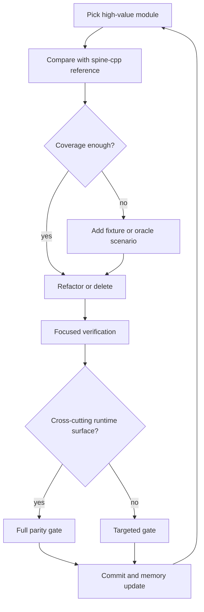
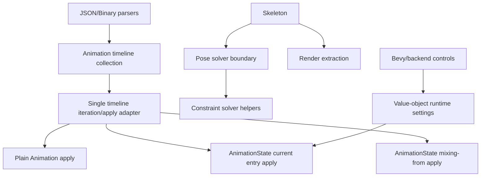

# refactor: Harden spine-cpp parity architecture

## Summary

Continue hardening the pure Rust Spine 4.3 runtime against the pinned `spine-cpp` reference by removing obsolete code, tightening dispatch boundaries, and adding characterization coverage before risky rewrites. The plan favors breaking internal and public Rust surfaces when that makes the runtime closer to `spine-cpp` and easier to audit.

---

## Problem Frame

The project now pins `spine-ts-4.3.8` as the latest tag anchor while treating `spine-cpp` as the sole behavior reference. The current parity suite is green, but several implementation modules remain too broad or too coupled to keep that parity easy to maintain: timeline storage and application are duplicated across parsing and runtime paths, `Skeleton` carries pose solving plus disabled legacy branches, and TrackEntry controls leak through multiple API layers.

This work is not a compatibility-preserving polish pass. The user explicitly wants fearless cleanup on local `main`: delete dead code, remove stale compatibility surfaces, add fixtures or goldens when they make behavior reviewable, and commit incremental verified slices.

---

## Requirements

**Parity and verification**

- R1. All runtime behavior changes must be judged against `spine-cpp`, not `spine-c`, `spine-ts`, or historical runtime tags.
- R2. Existing oracle, fixture, and smoke tests must stay green unless a failing test proves a real `spine-cpp` divergence that the slice then fixes.
- R3. New fixtures or goldens are added when a refactor changes behavior-critical code without existing coverage for that behavior.
- R4. Verification uses focused tests for the touched module and escalates to the full parity gate after cross-cutting runtime changes.

**Architecture and cleanup**

- R5. Disabled legacy code and unreachable compatibility branches should be deleted rather than preserved behind feature flags or comments.
- R6. Timeline dispatch should move toward one owned runtime path so parser/runtime modules do not each need to know every timeline variant.
- R7. `Skeleton` should move toward smaller pose-solver and constraint-solver boundaries without changing public behavior.
- R8. TrackEntry and backend control surfaces should expose intentional settings APIs rather than broad internal field access.

**Workflow**

- R9. Work lands in small local commits on `main`, each with a clear Conventional Commit message and no unrelated user changes.
- R10. Engineering wiki memory records plans, commits, verification results, and next actions so later sessions can resume without replaying chat.

---

## Key Technical Decisions

- **KTD1. Start from characterization, then delete:** The full parity gate is green, so first slices should remove disabled code and stale surfaces with focused checks before deeper behavior rewrites.
- **KTD2. Use `spine-cpp` source shape as the audit map:** For behavior-bearing code, compare against `spine-cpp/src/spine/*` and record intentional Rust API differences in repo docs or memory.
- **KTD3. Centralize timeline application before changing semantics:** The highest-risk duplication is timeline dispatch across plain apply, current-entry apply, mixing-from apply, JSON order reconstruction, and binary read order. Behavior edits should first make that dispatch easier to audit.
- **KTD4. Prefer deletion over compatibility adapters:** The project can break API, so obsolete `cfg(any())` blocks, legacy transform paths, and stale comments should be removed instead of hidden.
- **KTD5. Keep generated assets honest:** Existing golden `SOURCE.txt` files should not be rewritten unless the assets or oracle outputs are actually regenerated. If `spine-cpp` and examples have no diff across tags, record that as evidence rather than pretending a re-record happened.
- **KTD6. Commit by reviewable slice:** A plan/memory commit, a dead-code cleanup commit, and later timeline or solver commits are easier to bisect than one broad architecture commit.

---

## High-Level Technical Design

### Parity Hardening Loop

### Target Architecture Direction

---

## Scope Boundaries

### In Scope

- Remove disabled legacy code, stale compatibility comments, and unreachable helper paths.
- Refactor timeline dispatch and apply paths toward one audit-friendly module.
- Extract or narrow pose-solving responsibilities from the large `Skeleton` module when coverage is strong enough.
- Tighten TrackEntry and backend settings boundaries when they leak runtime internals.
- Add focused unit tests, upstream fixture cases, or oracle goldens for behavior that lacks coverage.
- Update engineering memory and active docs when the parity baseline or implementation direction changes.

### Deferred to Follow-Up Work

- Re-record all existing oracle goldens solely to update `SOURCE.txt` metadata.
- Redesign renderer backends beyond changes needed to preserve core runtime parity.
- Support old Spine export versions or compatibility shims.
- Replace the current C++ oracle toolchain unless it blocks parity investigation.

### Outside This Plan

- FFI bindings to official runtimes.
- A c2rust or bindgen rewrite.
- Publishing releases or opening remote pull requests.

---

## Implementation Units

### U1. Record the autonomous refactor operating baseline

**Goal:** Persist this plan and the current green parity state before changing runtime code.

**Requirements:** R1, R2, R9, R10.

**Dependencies:** None.

**Files:** `docs/plans/2026-06-23-001-refactor-spine-cpp-parity-hardening-plan.md`, `docs/knowledge/engineering/current-state.md`, `docs/knowledge/engineering/log.md`, optional `docs/knowledge/engineering/progress/*.md`.

**Approach:** Treat the latest tag pin commit and the full green parity gate as the baseline for subsequent slices. Record that work proceeds directly on local `main` with user authorization for incremental commits.

**Patterns to follow:** Existing plan frontmatter and engineering memory files under `docs/knowledge/engineering/`.

**Test scenarios:** Test expectation: none -- this unit writes planning and memory artifacts only.

**Verification:** The plan exists, engineering memory names the active goal and baseline evidence, and `git status` contains only the intended documentation files before commit.

### U2. Delete disabled Skeleton legacy code

**Goal:** Remove dead `#[cfg(any())]` code from `Skeleton` so future solver work has less false surface.

**Requirements:** R5, R7.

**Dependencies:** U1.

**Files:** `spine2d/src/runtime/skeleton.rs`, `spine2d/src/runtime/skeleton_tests.rs`, `spine2d/src/runtime/path_constraint_solve_tests.rs`, `spine2d/src/runtime/transform_constraint_tests.rs`.

**Approach:** Delete disabled scratch structs, alternate world-transform paths, legacy transform-constraint implementation, and inactive helper functions that cannot compile today. Keep live helper names and behavior unchanged.

**Patterns to follow:** Current live `update_cache`, `rebuild_update_cache`, and `update_world_transform_with_physics` paths in `spine2d/src/runtime/skeleton.rs`.

**Test scenarios:**

- Happy path: root/child world transform tests still produce the same world transforms.
- Integration path: path, transform, IK, slider, and physics oracle scenarios still pass after the deletion.
- Regression path: searching the runtime source finds no `#[cfg(any())]` blocks left in `skeleton.rs`.

**Verification:** Focused runtime solver tests pass, formatting is clean, and the full parity gate is still green if any live solver code moves.

### U3. Collapse timeline dispatch behind one adapter

**Goal:** Reduce duplicated `TimelineKind` dispatch across plain apply, current-entry apply, and mixing-from apply.

**Requirements:** R1, R2, R3, R6.

**Dependencies:** U1.

**Files:** `spine2d/src/runtime/animation.rs`, `spine2d/src/runtime/animation_state.rs`, `spine2d/src/model.rs`, `spine2d/src/runtime/animation_tests.rs`, `spine2d/src/runtime/animation_state_mixing_semantics_tests.rs`, `spine2d/src/runtime/oracle_scenario_parity_tests.rs`, `spine2d/src/json_timeline_order_tests.rs`, `spine2d/examples/pose_dump_scenario.rs`.

**Approach:** Introduce a small internal timeline iteration/apply boundary that owns the `TimelineKind` match and accepts context-specific policy for plain apply, current-entry apply, and mixing-from apply. Preserve parse-time order behind a crate-internal order field, expose a read-only unified `Animation::timelines()` view for C++-style inspection, and move the large match away from call sites.

**Patterns to follow:** Existing `animation_timeline_order`, `apply_entry_pose`, and `apply_mixing_from_pose` behavior; `spine-cpp/src/spine/AnimationState.cpp` for mode and threshold branching.

**Test scenarios:**

- Happy path: plain `Animation::apply` still applies slot, bone, constraint, deform, sequence, and draw-order timelines in parse order.
- Integration path: current-entry apply preserves property gating across multi-track overlay scenarios.
- Integration path: mixing-from apply preserves attachment, draw-order, HoldMix, additive, reverse, and shortest-rotation oracle scenarios.
- Edge path: animations with empty `timeline_order` still finalize to deterministic fallback order in tests that construct `Animation` manually.
- Integration path: `Animation::timelines()` exposes the same unified timeline order that C++ keeps in `Animation::getTimelines()`, with event timelines reported last when present.
- Regression path: diagnostics that render timeline order from the public iterator no longer need the raw order field.

**Verification:** Focused animation and animation-state tests pass before the full oracle scenario suite is used as the final gate for this unit.

### U4. Tighten parser timeline-order ownership

**Goal:** Make JSON and binary readers construct timeline order through one explicit builder instead of hand-maintaining scattered push logic.

**Status:** Complete in commit `48518a5`. The binary reader now records order through `TimelineOrderBuilder`; JSON kept its existing local `build_json_timeline_lookup` and `build_json_timeline_order` boundary.

**Requirements:** R1, R2, R6.

**Dependencies:** U3.

**Files:** `spine2d/src/json.rs`, `spine2d/src/binary.rs`, `spine2d/src/model.rs`, `spine2d/src/json_timeline_order_tests.rs`, `spine2d/src/binary_tests.rs`.

**Approach:** Extract a parser-side timeline-order builder that records every appended timeline as it is parsed. Keep JSON object-order reconstruction where required, but make missing timeline registration a localized test failure.

**Patterns to follow:** Existing `build_json_timeline_lookup`, `build_json_timeline_order`, and binary `read_animation` order pushes.

**Test scenarios:**

- Happy path: JSON object order is preserved for slot, bone, constraint, deform, sequence, draw order, and folder timelines.
- Happy path: binary read order matches the current parser for every supported timeline category.
- Edge path: tests with manually constructed animations still get fallback order from the shared helper.
- Regression path: adding a new timeline category without registering its order fails a focused test.

**Verification:** JSON timeline-order tests, binary timeline-order tests, and focused parser smoke tests pass before broader runtime checks.

### U5. Narrow TrackEntry and backend control surfaces

**Goal:** Move public mutation toward official setter/direct-assignment semantics and value-object settings instead of broad field access.

**Status:** Complete. Commit `f36cfa7` aligned the delay setter branch shape with `spine-cpp`; commit `fc1c241` made `TrackEntry` state private and exposed read-only getters; commit `e1e827f` temporarily moved entry settings into core `TrackEntrySettings`, but the current working-tree cleanup deletes that Rust-only core value object again and moves the command batching helper back to Bevy as `SpineTrackEntrySettings`. Commit `0c78468` removed Rust-only mix-duration validation from `AnimationStateData` and empty-animation setters so default mix, pair mix, and empty-animation mix durations use direct C++ assignment semantics. Commit `0a4204a` made `add_empty_animation` infallible and removed its Rust-only finite-delay guard, matching C++ `addEmptyAnimation` returning an entry directly. Commit `f381dc5` removed the Rust-only `AnimationState::update` delta guard and Bevy scaled-delta clamp, preserving C++ reverse-time update behavior. Commit `65c078f` removed Rust-only IK finite/positive mix guards so negative and NaN mix values propagate through C++-style solver math. Commit `64679c2` removed Rust-only nonpositive-alpha guards and clamps from state, constraint, slot color, slider, and deform timeline apply paths so timeline alpha follows C++ direct propagation. Commit `fce1ccc` tightened mix completion, threshold, queue, and track-end comparisons to the direct C++ comparison shape; a direct `interruptAlpha` rewrite was rejected by existing C++ oracle scenarios and should wait for a full C++ timeline-mode representation. The earlier `MixInterpolation` removal and `mixBlend` / `holdPrevious` restoration commits were based on a stale local development checkout and are superseded by the pinned `spine-ts-4.3.8` tag: current TrackEntry parity keeps `additive` and `mix_interpolation`, and deletes public `mix_blend` / `hold_previous`. Commit `866b732` added official-style TrackEntry query helpers and loop mutation: `is_complete`, `was_applied`, `is_empty_animation`, and `set_loop`; Bevy now provides `SpineTrackEntrySettings::with_looped` outside core. Commit `8c074f6` added safe-handle queue-neighbor helpers for C++ `getPrevious`, `getNext`, and `isNextReady`. Commit `cfd01fe` aligned queue link storage and time setters with C++ by storing previous/next explicitly and adding `mixing_from`, `mixing_to`, `set_track_time`, and `set_mix_time`. Commit `d39573a` aligned `AnimationState::apply` with the official C++ boolean return value so callers can observe whether any non-delayed track was applied. Commit `8a46380` added safe Rust equivalents for C++ `getCurrent` and `getData`: `current(track_index)` returns an optional `TrackEntryHandle`, and `data()` pairs with the existing `data_mut()`. Commit `f6b88fe` exposed `disable_queue` and `enable_queue`, matching C++ `disableQueue` / `enableQueue` event-queue drain gating. Commit `d0ada6c` added optional manual TrackEntry disposal, matching C++ `setManualTrackEntryDisposal`, `getManualTrackEntryDisposal`, and `disposeTrackEntry`. Commit `ca658f2` added a read-only `tracks()` view over sparse track slots, preserving `None` holes like C++ `getTracks()`. The current working-tree slice also narrows the internal `MixDirection` and `MixBlend` helpers to crate visibility, deletes the `TrackAnimationInput` overload adapter in favor of explicit name and `Animation&` entry points, makes the standalone `apply_animation` helper test-only, tightens `compute_hold` around C++ property-id scoping, additive/instant/property-overlap checks, and direct HoldMix alpha, and aligns `clearNext` event ordering for normal replacement plus clear-track disposal. The runtime still uses `apply_animation_applied` internally for slider-driven pose updates, but the plain sampling helper, internal blend enum, ECS settings helper, and overload adapter are no longer part of the non-test public core crate surface.

**Recent update:** `TrackEntryHandle::set_animation`, `AnimationState::set_animation`, and `AnimationState::add_animation` now distinguish the C++ name overload from the `Animation&` overload: name inputs resolve through `SkeletonData`, while animation-object inputs preserve the supplied object and use animation identity for the same-animation replacement branch. The public `AnimationState` shape no longer uses a private-bound Rust overload bridge: `set_animation` / `add_animation` are name overloads, and `set_animation_ref` / `add_animation_ref` are the explicit Rust equivalents of the C++ `Animation&` overloads. `AnimationStateData` mix storage keys by animation name like C++ `AnimationPair::operator==`, and the animation-reference mix accessors now use the direct C++ return shapes: `set_mix_animation` returns `()` and `get_mix_animation` returns `f32`. `AnimationStateData::set_mix`, `AnimationState::set_animation`, and `AnimationState::add_animation` now also use C++ direct-return/assert semantics for the public name overloads, so missing animation names panic instead of returning `Result`. The stale `Error::InvalidTrackIndex` variant was deleted because no current track API returns that Rust-only error shape. TrackEntry queue lifecycle now mirrors more C++ link details: queued promotion clears the old current entry's `next`, empty-track queued starts mark `animations_changed`, normal replacement queues discarded-entry dispose before current interrupt like C++ `clearNext(current)`, `clear_track` disposes queued next entries before ending the mixing-from chain, negative `set_delay` is ignored, stale neighbor handles filter disposed targets, and manual disposal preserves disposed queued links until explicit disposal. `TrackEntry::animation_time()` now follows C++ `MathUtil::fmod` plus direct duration comparisons for looping and non-looping entries, complete detection uses direct C++ boundary and zero-duration comparisons, and `TrackEntry::track_complete()` follows C++ integer truncation for loop counts instead of Rust-only normalized/floor behavior. Event processing now has the same conceptual layering as C++: `collect_events` mirrors raw `EventTimeline::apply`, while `apply_entry_events_and_complete` mirrors `AnimationState::queueEvents` ordering/filtering, preserves signed `trackLastWrapped` remainder behavior, and skips EventTimeline event collection for reverse playback like C++'s null event buffer path. The remaining `mixDuration` zero checks now also use exact C++ equality, so zero durations take the single-frame path and negative mix durations remain preserved on queued entries. `apply_mixing_from_pose` now also follows C++ `applyMixingFrom` for the non-hold `DrawOrderTimeline` `drawOrder == false && mixFrom == Current` branch by skipping before `total_alpha` accounting; draw-order-only outgoing entries no longer keep the mixing chain alive after their mix completes. `AnimationState::update` now consumes the recursive `update_mixing_from` completion return like C++ and clears any remaining current `mixing_from` chain once all mixing-from entries have completed, including hold-mix cases where `total_alpha` remains nonzero until the outer cleanup. `AnimationState::compute_hold` now keeps `property_ids` alive for the whole `animations_changed` pass like C++ `_propertyIDs`, uses explicit helpers equivalent to `Timeline::getAdditive`, `Timeline::getInstant`, and `Animation::hasTimeline(ids)`, and applies hold-mix alpha as direct `1 - mix` without a Rust-only clamp. Latest tag `spine-ts-4.3.8` exposes `TrackEntry::additive` and `mix_interpolation`; the stale-checkout `mixBlend` / `holdPrevious` public API has been removed from Rust, Bevy, scenarios, and oracle tooling.

**Requirements:** R1, R2, R8.

**Dependencies:** U3.

**Files:** `spine2d/src/error.rs`, `spine2d/src/runtime/animation_state.rs`, `spine2d/src/runtime/animation_state_mixing_semantics_tests.rs`, `spine2d/src/runtime/animation_state_tests.rs`, `spine2d/src/runtime/animation.rs`, `spine2d/src/render_scenario.rs`, `spine2d/examples/pose_dump_scenario.rs`, `spine2d-bevy/src/components.rs`, `spine2d-bevy/src/systems.rs`, `spine2d-bevy/examples/mixing_inspector.rs`, `scripts/record_oracle_goldens.py`, `scripts/spine_cpp_lite_oracle.cpp`, `scripts/spine_cpp_lite_render_oracle.cpp`.

**Approach:** Audit `TrackEntry` fields against `spine-cpp/include/spine/AnimationState.h`. Keep user-facing controls that match official behavior, delete or privatize stale Rust-only fields, and make backend settings apply through one helper.

**Patterns to follow:** Existing `TrackEntryHandle` setters and the Bevy `SpineTrackEntrySettings` application path.

**Test scenarios:**

- Happy path: every retained per-entry setting changes the same runtime behavior as before.
- Direct-assignment path: default mix, pair mix, empty-animation mix duration, `add_empty_animation` delay, `AnimationState::update` delta, IK mix values, timeline alpha values, and mix/threshold boundary comparisons propagate the exact `f32` shape used by the official path, including reverse/non-finite or nonpositive values where C++ does not validate.
- Event queue path: raw event collection matches C++ `EventTimeline::apply`, `queueEvents` owns animation start/end filtering and complete-before/after ordering, negative `trackLastWrapped` remains signed instead of being normalized before event split decisions, and reverse entries do not queue EventTimeline events.
- API parity path: latest-tag public TrackEntry controls are `additive` / `set_additive(bool)` / `with_additive(bool)` and `mix_interpolation` / `set_mix_interpolation(MixInterpolation)` / `with_mix_interpolation(MixInterpolation)`, matching C++ `getAdditive/setAdditive` and `getMixInterpolation/setMixInterpolation`; stale-checkout `mix_blend`, `set_mix_blend`, `with_mix_blend`, `hold_previous`, `set_hold_previous`, and `with_hold_previous` do not compile. Public query/control helpers include `is_complete`, `was_applied`, `is_empty_animation`, `set_loop`, `with_looped`, `previous`, `next`, `is_next_ready`, `mixing_from`, `mixing_to`, `set_track_time`, and `set_mix_time`, matching C++ `isComplete`, `wasApplied`, `isEmptyAnimation`, `setLoop`, `getPrevious`, `getNext`, `isNextReady`, `getMixingFrom`, `getMixingTo`, `setTrackTime`, and `setMixTime`; `AnimationState::set_animation` / `add_animation` cover name overloads while `set_animation_ref` / `add_animation_ref` cover `Animation&` overloads; `AnimationState::apply` returns `bool` like C++ `apply(Skeleton&)`; `AnimationState::current` and `data` cover C++ `getCurrent` and `getData`; `disable_queue` and `enable_queue` cover C++ `disableQueue` and `enableQueue`; `set_manual_track_entry_disposal`, `manual_track_entry_disposal`, and `dispose_track_entry` cover the official manual disposal controls; `tracks()` preserves sparse track slots like C++ `getTracks()`.
- Error path: missing animation names panic like C++ name-overload assertions; do not reintroduce `Result` wrappers or blanket duration validation.
- Integration path: Bevy command settings still apply to set, add, empty, and queued entries.
- Mixing lifecycle path: a non-hold draw-order-only outgoing entry on a higher track detaches after its mix completes when the draw-order property is already owned by another current track, matching C++ `DrawOrderTimeline` `Current` skip behavior and `totalAlpha` accounting.
- Mixing lifecycle path: a completed hold-mix chain with nonzero outgoing `totalAlpha` still detaches from the current entry when the recursive `update_mixing_from` chain reports complete, matching the C++ outer `AnimationState::update` cleanup.
- Event queue lifecycle path: `End` events are queued as `End` only and fall through to `Dispose` notification/release during drain like C++ `EventQueue::drain`; direct `Dispose` queue entries are reserved for queued entries discarded without an `End`.
- API cleanup path: stale removed fields no longer compile in crate tests, and no internal code depends on public field mutation.

**Verification:** Core animation-state tests and Bevy backend tests pass, with public API breakage captured in docs or release notes when needed.

### U6. Extract Skeleton pose-solver boundaries incrementally

**Goal:** Split the largest live `Skeleton` responsibilities after dead code has been removed and solver coverage is confirmed.

**Status:** In progress. Commit `3edaa0b` moved path constraint scratch storage and capacity estimation into private `skeleton::path`. Commit `0dab0fb` moved path attachment lookup, path world-position calculation, and private path curve helpers into `skeleton::path`; the generic attachment world-vertex helper remains in `skeleton.rs` because it is shared by path solving and `Skeleton::world_vertices`. Commit `190a119` moved update-cache ordering into private `skeleton::cache`, keeping Rust's centralized constraint storage while matching the official C++ responsibility boundary more closely. Commit `757b2f7` moved BonePose-equivalent world/local transform helpers and root/child world-transform math into private `skeleton::bone`, while `Bone` itself remains in `skeleton.rs` for now. Commit `a37abac` moved BonePose-equivalent `modifyWorld`, `modifyLocal`, child world-reset, and applied-transform decomposition into `skeleton::bone`. Commit `fc3ef3c` moved the bone world-transform update entry into `skeleton::bone`, completing the low-risk BonePose helper extraction slice. Commit `e076419` moved the IK solver entry and helper routines into `skeleton::ik`. Commit `d772a9f` moved the transform constraint solver entry and helper routines into `skeleton::transform`. Commit `6be2f7b` moved the physics constraint solver entry and helper routines into `skeleton::physics`. Commit `6104586` moved the slider constraint solver entry and helper routines into `skeleton::slider`. Commit `5e93794` moved the path constraint apply entry into `skeleton::path` and narrowed path-only helper visibility. Commit `7f98a3d` moved generic attachment world-vertices computation into `skeleton::vertices`. Commit `b712f53` moved the `Bone` runtime type into `skeleton::bone` and re-exported it from `skeleton`. Commit `6f56a26` moved the `Slot` runtime type into `skeleton::slot` and re-exported it from `skeleton`. Commit `fcf3389` moved IK, transform, path, physics, and slider runtime constraint types into their matching private modules and re-exported them from `skeleton`. Commit `047be09` narrowed `Skeleton` container/state fields to crate visibility and added public collection accessors plus official-style color, position, and scale setters. Commit `12218d2` narrowed `Bone` local pose, applied pose, active state, and world-transform fields behind public accessors/setters matching `BoneLocal` and `BonePose`. Commit `2643dd0` narrowed `Slot` pose fields behind public accessors/setters matching `SlotPose`, including attachment-change deform/sequence reset. Commit `0c8d8cd` narrowed IK, transform, path, physics, and slider runtime pose fields behind public accessors/setters matching official C++ constraint pose/control surfaces. Commit `ecdf83f` added official-style `Skeleton` and `PhysicsConstraint` physics translate/rotate controls. Commit `9bae119` added official-style named lookup helpers and source-skin-aware attachment semantics on `Skeleton`. Commit `83df693` added a no-clipper `Skeleton::bounds` helper over active region and mesh attachments. Commit `fed0975` added official-style by-name lookup helpers for IK, transform, path, physics, and slider constraints, then direct index lookup was reduced to private implementation helpers because latest-tag C++ exposes `findConstraint<T>` rather than public index lookup helpers. Commit `955cc27` added official-style `setup_pose`, `setup_pose_bones`, and `setup_pose_slots` split APIs and corrected empty setup attachment `sequenceIndex` reset semantics. Commit `c385349` removed the legacy `set_to_setup_pose` alias as a breaking API cleanup and migrated internal callers to `setup_pose`. The Bevy wrapper now follows that same naming: `SpineSkeletonCommand::reset_to_setup_pose` / `ResetToSetupPose` were deleted in favor of `setup_pose` / `SetupPose`.

**Recent update:** Commit `43c5503` added `Skeleton::bounds_with_clipping`, matching the `spine-cpp` `getBounds(..., SkeletonClipping*)` overload while keeping `bounds()` aligned with the default no-clipper overload.

**Recent update:** `PointAttachmentData::compute_world_rotation` now follows the C++ `PointAttachment::computeWorldRotation` matrix formula instead of the old pure-rotation shortcut. The attachment rotation is applied to the bone matrix before `atan2`, which keeps the non-uniform-scale case aligned with the latest-tag reference and adds a focused regression for that path.

**Recent update:** Commit `aec70e4` aligned Skeleton world and skin controls with C++ setter semantics: direct wind/gravity/time/update assignment, component wind/gravity accessors, no-op missing skins, and no dead `UnknownSkin` runtime error. Commit `ae1ab99` removed the now-useless `set_skin` `Result` wrapper.

**Recent update:** Commit `ea3d166` aligned `Skeleton::skin()` with C++ `getSkin()` by returning current `SkinData`; the stored skin name is now kept internal. A follow-up pass removed the separate `skin_name()` accessor, trimmed the remaining Rust-only `attachment_by_slot_name` and mutable name lookup helpers, and short-circuited no-op skin setter calls to better match the C++ setter shape. The next parity cleanup slice removed Rust-only `Skeleton::position`, `Skeleton::scale`, `Skeleton::wind`, `Skeleton::gravity`, `Bone::position`, `Bone::scale`, `Bone::applied_position`, `Bone::applied_scale`, `Bone::applied_shear`, and `Bone::world_position` tuple helpers; callers now read the individual component accessors directly. It also removed Rust-only grouped setters `Bone::set_applied_position`, `set_applied_scale`, `set_applied_shear`, and `set_world_position`; callers now use C++-style component setters. `PointAttachmentData::compute_world_position` / `compute_world_rotation` remain public because they mirror official `PointAttachment` methods.

**Recent update:** Commit `f0903f1` added `Skeleton::update_cache_items()` and public `UpdateCacheItem`, exposing a read-only Rust equivalent of C++ `getUpdateCache()`.

**Recent update:** Rechecked the earlier `Skeleton::constraints()` / public `ConstraintRef` wrapper from commit `295c836` against latest-tag `spine-cpp`; C++ still exposes `Skeleton::getConstraints()`, so the Rust typed wrapper remains the safe analogue for the unified constraint view.

**Recent update:** Commit `c20ab80` added `Bone::child_indices`, parent-space point transforms, local/world rotation transforms, and `rotate_world`, covering the remaining C++ `Bone`/`BonePose` helper surface while preserving Rust's index-based skeleton storage model.

**Recent update:** Commit `b2cadd4` added `Skeleton` single-bone world/local transform update, validation, and modification marker helpers, covering C++ `BonePose::updateWorldTransform`, `updateLocalTransform`, `validateLocalTransform`, `modifyLocal`, and `modifyWorld` without exposing the raw update counter.

**Recent update:** Commit `e3e96c0` aligned the public local-transform update wrappers with C++ `BonePose::updateLocalTransform` by keeping the world epoch current after rebuilding applied local state.

**Recent update:** Commit `d374ddf` added the C++-style `Bone::is_y_down/set_y_down` global control and routed `Skeleton::scale_y()` plus BonePose transform math through the effective scaleY while preserving the repo's default Y-up baseline.

**Recent update:** Commit `71ddc60` removed the Rust-only hidden `Skeleton::debug_update_cache` helper; debug callers now format the typed `update_cache_items()` view locally.

**Recent update:** Commit `9ea3c43` renamed the hidden vertex helper to documented `Skeleton::slot_attachment_world_vertices`, keeping the useful C++ `VertexAttachment::computeWorldVertices` equivalent while deleting the old hidden name.

**Recent update:** Commit `26c4709` split applied draw order from the unconstrained pose and routed slider draw-order timelines through the applied buffer, matching C++ `DrawOrder` semantics more closely without adding a dedicated wrapper type yet.

**Recent update:** Commit `9147966` split applied slot pose from the unconstrained slot pose and routed slider-driven slot, attachment, sequence, and deform timelines through the applied buffer, matching C++ `Slot`/`SlotPose` applied-pose semantics more closely without exposing raw `PosedGeneric` internals.

**Recent update:** Commit `068263d` removed the Rust-only `Slot::set_attachment_name` public helper. Bare name mutation cannot match C++ `SlotPose::setAttachment(Attachment*)` because it lacks attachment object identity and timeline-attachment comparison; runtime name changes now use `Skeleton::set_attachment`.

**Recent update:** Commit `7b83c3c` removed the Rust-only `Slot::set_bone_index` public helper. C++ exposes `Slot::getBone()` but not runtime slot rebinding, so Rust keeps `bone_index()` read-only for external callers.

**Recent update:** Commit `9afff8b` removed runtime `Slot` blend storage and moved draw extraction back to `SlotData.blend`, matching C++ where blend mode is a `SlotData` property rather than mutable `SlotPose` state.

**Recent update:** Commit `4f8b351` centralized attachment source-skin resolution and timeline-attachment comparison so public `Skeleton::set_attachment`, `set_skin` attachAll paths, and animation attachment timelines all follow C++ `SlotPose::setAttachment` deform reset semantics.

**Recent update:** Commit `b3ca6c1` added official-style `SkinData` attachment helpers (`set_attachment`, `remove_attachment`, names/attachments/entries queries) and routed `add_skin` through the growable set path used by C++ `Skin::setAttachment`.

**Recent update:** A follow-up latest-tag `spine-cpp` recheck found no additional Skin / Attachment action item. The remaining C++ `Skin` surface differences are either already represented by Rust's owned-value semantics or covered by the existing helper/test surface, so this area should not be revisited unless a new oracle delta appears.

**Recent update:** Commit `7cd8d8c` removed the Rust-only success return from `Skeleton::set_attachment`, matching C++ `Skeleton::setAttachment` as a void method with no-op-on-miss behavior.

**Recent update:** The Rust-only zero-argument `Skeleton::update_world_transform()` helper was removed. Callers now use `Skeleton::update_world_transform_with_physics(Physics::None)` for the old no-physics path, matching latest-tag `spine-cpp` where `Skeleton::updateWorldTransform` always takes an explicit `Physics` argument.

**Recent update:** Rust-only `SkeletonData` lookup helper spellings were removed. Callers now use `SkeletonData::find_animation(name) -> Option<&Animation>` and `SkeletonData::find_skin(name)`, matching latest-tag `spine-cpp` `findAnimation` / `findSkin`; the pose dump finds the animation by name for its diagnostic index field.

**Recent update:** Rust-only public `Skeleton::find_*_index` helpers were removed for bones, slots, and typed constraints. Public lookups now match latest-tag `spine-cpp` by returning the object (`find_bone`, `find_slot`, typed `find_*_constraint`), and callers can read `data_index()` from the returned object when they need an index. The most recent runtime cleanup also removed the Rust-only tuple setters `Skeleton::set_wind` and `Skeleton::set_gravity`; callers now use the explicit component setters like the rest of the C++ surface.

**Recent update:** The binary `.skel` `spineboy_run_to_walk_mix0_2_t0_4` IK boundary now matches direct `spine-cpp` oracle output. The golden was correct; Rust was choosing the stretched two-bone IK branch when the cosine landed one `f32` ULP above `1.0`. The IK solver now keeps only that one-ULP overrun on the C++ tiny-bend path, and BonePose transform math uses C++-style degree/radian conversion plus fused multiply-add shaped world updates. Full core parity passed with `619 passed, 10 skipped`.

**Requirements:** R2, R3, R7.

**Dependencies:** U2.

**Files:** `spine2d/src/runtime/skeleton.rs`, optional new files under `spine2d/src/runtime/`, `spine2d/src/runtime/skeleton_tests.rs`, `spine2d/src/runtime/path_constraint_solve_tests.rs`, `spine2d/src/runtime/oracle_scenario_parity_tests.rs`.

**Approach:** Move cohesive solver helpers behind private modules and harden the public runtime surface where official C++ uses getter/setter access instead of public structural fields. Start with pure helper groups that already behave like submodules, then consider constraint-specific extraction or accessor narrowing only when tests cover the affected path. Prefer removing structural field exposure in favor of accessor methods when the official C++ runtime models the same state as a pose object or control surface.

**Patterns to follow:** Existing private helper grouping around IK, path, transform, slider, and physics constraint application.

**Test scenarios:**

- Happy path: setup pose, update cache, and world-transform tests stay unchanged.
- Integration path: path/IK/transform/slider/physics oracle scenarios remain green.
- Edge path: inactive bone and skin-required gating still matches current tests.
- Regression path: no additional allocation or clone regressions appear in solver hot paths that already reused scratch buffers.

**Verification:** Focused solver tests pass after each extraction, and the full parity gate passes after any cross-constraint module move.

### U7. Reassess fixture and golden coverage after each risky slice

**Goal:** Add only useful characterization coverage, keeping goldens honest and reviewable.

**Requirements:** R2, R3, R4, R10.

**Dependencies:** U2, U3, U4, U5, U6 as needed.

**Status:** In progress. The render oracle toolchain is now scenario-only on both sides: `scripts/spine_cpp_lite_render_oracle.cpp` and `spine2d/examples/render_dump.rs` accept command streams instead of the deleted single-animation `--anim` / `--time` mode. `scripts/record_oracle_render_goldens.py` and `scripts/render_parity_smoke.zsh` use the same scenario surface, render goldens were re-recorded, and focused render verification stayed green against the pinned `spine-ts-4.3.8` / `8e12b1250ab88c0f890849ea45aab80338cead63` baseline. The old one-shot `spine2d/examples/pose_dump.rs` example was also deleted, leaving `pose_dump_scenario` as the single Rust pose-dump surface for single-track, mixing, and multi-track oracle samples. `pose_dump_scenario` now also accepts `--entry-event-threshold` and `--entry-alpha-attachment-threshold`, so the Rust pose, Rust render, and C++ pose/render scenario CLIs expose the same TrackEntry threshold controls. The Rust-only inherent `Atlas::from_str` alias was deleted as a breaking public-surface cleanup; `Atlas::parse` and the standard `FromStr` implementation remain the supported text atlas entry points, while repo callers now use `Atlas::parse`. The Atlas reader now also preserves C++ `getRegions()` parse order, page format/index/texture path/filter/wrap enum surface, region index/rotate, UVs, post-rotation packed dimensions, and unknown region metadata instead of the older Rust `HashMap` region surface; Rust-only `AtlasPage.scale`, `Atlas::page(index)`, and `Atlas::region(name)` surfaces were removed.

**Recent update:** `Atlas.regions` now uses an ordered `Vec<AtlasRegion>` to match C++ `Atlas::getRegions()`, and `Atlas::find_region(name)` scans by region name like `Atlas::findRegion`. The parser was reshaped around the official page/region read loop, so test fixtures now use official atlas layout: page properties run directly into the first region, and blank lines separate pages. `AtlasPage.index`, `AtlasPage.format`, `AtlasPage.texture_path`, `AtlasFilter::Unknown`, `AtlasWrap::MirroredRepeat`, `AtlasRegion.index`, `AtlasRegion.rotate`, `AtlasRegion.u/v/u2/v2`, `AtlasRegion.region_width/region_height`, `AtlasRegion.packed_width/packed_height`, and unknown region fields such as `split` / `pad` are preserved for public inspection. `AtlasPage.scale`, `Atlas::page(index)`, and the old `Atlas::region(name)` spelling were deleted because they have no latest-tag C++ counterpart. `Atlas::flip_v` mirrors C++ `Atlas::flipV`, render trim/mesh UV code consumes the C++ packed dimensions for rotated regions, and draw extraction emits the page texture path rather than using the page name directly.

**Recent update:** The stale beta audit entry points were removed and the active latest-tag audit map is now `docs/upstream-audit-4.3-latest.md`. `scripts/check_spine_baseline.py` validates that current map instead of the deleted beta docs, and a focused recheck of additive/instant timeline classification plus the remaining `AnimationStateData` / `TrackEntry` surface found no runtime change needed.

**Recent update:** JSON and binary version gates now match the latest-tag C++ runtime's `SPINE_VERSION_STRING` prefix check: parsed export versions must start with `4.3`, and binary empty/missing versions are no longer accepted. The JSON upstream smoke suite was adjusted to skip non-4.3 example files before invoking the parser, matching the existing `.skel` smoke posture, and `version_tests` now records the rejected-version boundary for both JSON and binary version headers.

**Recent update:** The latest-tag `Skin` surface recheck found that Rust had attachment helper behavior covered but was missing `Skin::getColor` and `copySkin`. `SkinData` now stores the official default color, JSON/Binary parsers preserve skin color where C++ reads it, and `copy_skin` covers the C++ copy-composition entry point in Rust's owned-value attachment model.

**Recent update:** The latest-tag `SkeletonData` header surface was aligned for the string/bytes parser entry points. Rust now keeps the C++ header metadata from JSON and binary loaders (`hash`, bounds, `reference_scale`, `fps`, image/audio paths), adds C++ default constants for manually constructed data, treats binary hash `0` as empty and other hashes as signed 64-bit decimal strings, and keeps bounds unscaled while scaling only `reference_scale`. `name` defaults to empty because this crate currently has no path-based loader that can derive a skeleton name like C++ file loaders.

**Recent update:** `SkeletonData` now also exposes a C++-style `default_skin()` helper plus `find_slider_animations(&mut Vec<&Animation>)`. Rust attachment lookup and source-skin resolution now route through `default_skin()` instead of repeated literal `"default"` checks, and the slider helper appends referenced animations into a caller buffer like `SkeletonData::findSliderAnimations`.

**Recent update:** `SkeletonData` now has the remaining named data lookup helpers from the C++ data surface: bone, slot, event, and typed constraint lookups. Rust keeps separate typed constraint vectors rather than a C++ pointer array, but the public helpers now cover the same use cases as `findBone`, `findSlot`, `findEvent`, and `findConstraint<T>`. Name-based lookups now scan stored object names like C++ `findWithName`; the public `SkeletonData.animation_index` field was removed, and parser-local animation lookup tables stay internal to the loaders.

**Recent update:** `SkeletonData.skins` and `SkeletonData.events` now use ordered `IndexMap` storage, intentionally breaking the old `HashMap` field type to match C++ `getSkins()` / `getEvents()` array-order semantics. JSON and binary parser outputs now preserve the observable skin/event order without a separate side table, and focused regressions cover manual plus JSON order preservation.

**Recent update:** `SkeletonData::constraints()` now covers the C++ `SkeletonData::getConstraints()` unified data view. Rust still stores constraint data in typed vectors, but returns `ConstraintDataRef` entries in parser-assigned unified order with name/order/skin-required/data-index helpers, and JSON mixed-type constraint parsing now has focused coverage.

**Recent update:** `Animation` now exposes `bones()` as the Rust equivalent of C++ `Animation::getBones()`, and `BoneTimeline::bone_index()` exposes each concrete bone timeline target. The implementation derives unique affected bone indices from stored bone timelines rather than adding a separate parser-maintained cache. Slider runtime initialization now uses this helper instead of its previous local sorted/deduped collector.

**Recent update:** `Animation::color` now covers the C++ `Animation::getColor()` field. JSON animation objects preserve the optional color string, binary animations preserve the trailing nonessential RGBA block, and the model defaults to white when the field is absent.

**Recent update:** Point, path, bounding box, and clipping attachments now keep the latest-tag C++ `getColor()` data. The Rust model records type-specific C++ constructor defaults, JSON applies explicit/default attachment colors per type, and binary preserves nonessential attachment colors instead of discarding them.

**Files:** `spine2d/Cargo.toml`, `spine2d/src/atlas.rs`, `spine2d/src/runtime/oracle_scenario_parity_tests.rs`, `spine2d/src/render_oracle_parity_tests.rs`, `spine2d/examples/pose_dump_scenario.rs`, `spine2d/examples/render_dump.rs`, `spine2d/tests/golden/**`, `spine2d-bevy/src/asset_loader.rs`, `spine2d-bevy/src/spine_world.rs`, `spine2d-bevy/src/systems.rs`, `spine2d-web/src/lib.rs`, `spine2d-wgpu/examples/basic.rs`, `spine2d-wgpu/examples/spine_runtimes.rs`, `scripts/record_oracle_goldens.py`, `scripts/record_oracle_render_goldens.py`, `scripts/render_parity_smoke.zsh`, `scripts/spine_cpp_lite_render_oracle.cpp`, `docs/decisions.md`, `docs/parity.md`, `docs/upstream-audit-4.3-latest.md`.

**Approach:** When refactoring touches behavior with weak coverage, add the smallest C++ oracle scenario or fixture that proves the relevant rule. Do not refresh all goldens just to update metadata.

**Patterns to follow:** Existing scenario oracle naming and `SOURCE.txt` notes under `spine2d/tests/golden/`.

**Test scenarios:**

- Happy path: new fixture fails against the old bug or uncharacterized behavior before the refactor when practical.
- Integration path: new golden output includes enough state to identify the behavior under review.
- Metadata path: `SOURCE.txt` reflects the actual generation commit and tag when a golden is regenerated.

**Verification:** New fixture or golden is covered by focused tests and included in the relevant parity checklist update.

---

## System-Wide Impact

The highest-risk surfaces are `AnimationState::apply`, timeline parsing order, and `Skeleton::update_world_transform_with_physics`. These are shared by JSON, binary, Bevy, render extraction, and oracle tests. Any change in these areas must be treated as cross-cutting even when the edited file count is small.

---

## Risks & Dependencies

- **False confidence from green tests:** Existing parity coverage is broad but not complete. Mitigation: add characterization before changing behavior-critical uncovered branches.
- **API breakage is intentional but still costly:** Removing public fields or old helpers may break downstream users. Mitigation: break in coherent slices and record the replacement path.
- **Large-file refactors can hide behavior changes:** `skeleton.rs`, `animation.rs`, and `animation_state.rs` are large enough for accidental edits. Mitigation: keep commits narrow and verify before staging.
- **Golden metadata can drift from content:** Existing goldens were recorded at older tag metadata while `spine-cpp` and examples are identical across the relevant tags. Mitigation: do not rewrite metadata unless outputs are regenerated.

---

## Sources / Research

- `spine-upstream.toml` pins `spine-ts-4.3.8` while active docs define `spine-cpp` as the behavior reference.
- `docs/parity.md` records the current green parity matrix and remaining edge-case posture.
- `docs/upstream-audit-4.3-latest.md` defines the `spine-cpp` audit workflow.
- `docs/decisions.md` records the pure Rust, no-FFI, Spine 4.3 runtime stance.
- `spine2d/src/runtime/animation.rs`, `spine2d/src/runtime/animation_state.rs`, `spine2d/src/runtime/skeleton.rs`, `spine2d/src/json.rs`, and `spine2d/src/binary.rs` are the primary audit surfaces.
