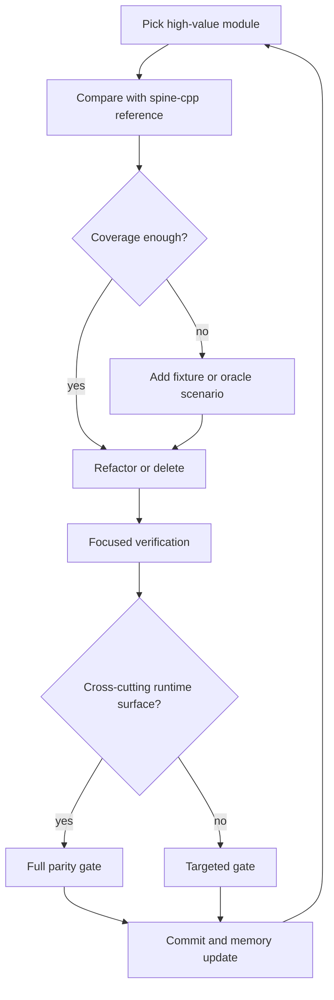
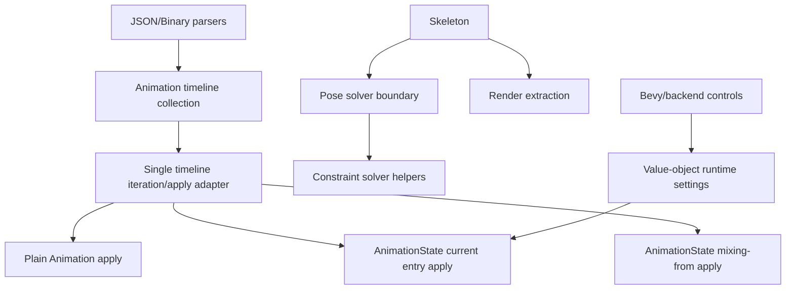

# refactor: Harden spine-cpp parity architecture

## Summary

Continue hardening the pure Rust Spine 4.3 runtime against the pinned `spine-cpp` reference by removing obsolete code, tightening dispatch boundaries, and adding characterization coverage before risky rewrites. The plan favors breaking internal and public Rust surfaces when that makes the runtime closer to `spine-cpp` and easier to audit.

---

## Problem Frame

The project now pins `spine-ts-4.3.8` as the latest tag anchor while treating `spine-cpp` as the sole behavior reference. The current parity suite is green, but several implementation modules remain too broad or too coupled to keep that parity easy to maintain: timeline storage and application are duplicated across parsing and runtime paths, `Skeleton` carries pose solving plus disabled legacy branches, and TrackEntry controls leak through multiple API layers.

This work is not a compatibility-preserving polish pass. The user explicitly wants fearless cleanup on local `main`: delete dead code, remove stale compatibility surfaces, add fixtures or goldens when they make behavior reviewable, and commit incremental verified slices.

---

## Requirements

**Parity and verification**

- R1. All runtime behavior changes must be judged against `spine-cpp`, not `spine-c`, `spine-ts`, or historical runtime tags.
- R2. Existing oracle, fixture, and smoke tests must stay green unless a failing test proves a real `spine-cpp` divergence that the slice then fixes.
- R3. New fixtures or goldens are added when a refactor changes behavior-critical code without existing coverage for that behavior.
- R4. Verification uses focused tests for the touched module and escalates to the full parity gate after cross-cutting runtime changes.

**Architecture and cleanup**

- R5. Disabled legacy code and unreachable compatibility branches should be deleted rather than preserved behind feature flags or comments.
- R6. Timeline dispatch should move toward one owned runtime path so parser/runtime modules do not each need to know every timeline variant.
- R7. `Skeleton` should move toward smaller pose-solver and constraint-solver boundaries without changing public behavior.
- R8. TrackEntry and backend control surfaces should expose intentional settings APIs rather than broad internal field access.

**Workflow**

- R9. Work lands in small local commits on `main`, each with a clear Conventional Commit message and no unrelated user changes.
- R10. Engineering wiki memory records plans, commits, verification results, and next actions so later sessions can resume without replaying chat.

---

## Key Technical Decisions

- **KTD1. Start from characterization, then delete:** The full parity gate is green, so first slices should remove disabled code and stale surfaces with focused checks before deeper behavior rewrites.
- **KTD2. Use `spine-cpp` source shape as the audit map:** For behavior-bearing code, compare against `spine-cpp/src/spine/*` and record intentional Rust API differences in repo docs or memory.
- **KTD3. Centralize timeline application before changing semantics:** The highest-risk duplication is timeline dispatch across plain apply, current-entry apply, mixing-from apply, JSON order reconstruction, and binary read order. Behavior edits should first make that dispatch easier to audit.
- **KTD4. Prefer deletion over compatibility adapters:** The project can break API, so obsolete `cfg(any())` blocks, legacy transform paths, and stale comments should be removed instead of hidden.
- **KTD5. Keep generated assets honest:** Existing golden `SOURCE.txt` files should not be rewritten unless the assets or oracle outputs are actually regenerated. If `spine-cpp` and examples have no diff across tags, record that as evidence rather than pretending a re-record happened.
- **KTD6. Commit by reviewable slice:** A plan/memory commit, a dead-code cleanup commit, and later timeline or solver commits are easier to bisect than one broad architecture commit.

---

## High-Level Technical Design

### Parity Hardening Loop

### Target Architecture Direction

---

## Scope Boundaries

### In Scope

- Remove disabled legacy code, stale compatibility comments, and unreachable helper paths.
- Refactor timeline dispatch and apply paths toward one audit-friendly module.
- Extract or narrow pose-solving responsibilities from the large `Skeleton` module when coverage is strong enough.
- Tighten TrackEntry and backend settings boundaries when they leak runtime internals.
- Add focused unit tests, upstream fixture cases, or oracle goldens for behavior that lacks coverage.
- Update engineering memory and active docs when the parity baseline or implementation direction changes.

### Deferred to Follow-Up Work

- Re-record all existing oracle goldens solely to update `SOURCE.txt` metadata.
- Redesign renderer backends beyond changes needed to preserve core runtime parity.
- Support old Spine export versions or compatibility shims.
- Replace the current C++ oracle toolchain unless it blocks parity investigation.

### Outside This Plan

- FFI bindings to official runtimes.
- A c2rust or bindgen rewrite.
- Publishing releases or opening remote pull requests.

---

## Implementation Units

### U1. Record the autonomous refactor operating baseline

**Goal:** Persist this plan and the current green parity state before changing runtime code.

**Requirements:** R1, R2, R9, R10.

**Dependencies:** None.

**Files:** `docs/plans/2026-06-23-001-refactor-spine-cpp-parity-hardening-plan.md`, `docs/knowledge/engineering/current-state.md`, `docs/knowledge/engineering/log.md`, optional `docs/knowledge/engineering/progress/*.md`.

**Approach:** Treat the latest tag pin commit and the full green parity gate as the baseline for subsequent slices. Record that work proceeds directly on local `main` with user authorization for incremental commits.

**Patterns to follow:** Existing plan frontmatter and engineering memory files under `docs/knowledge/engineering/`.

**Test scenarios:** Test expectation: none -- this unit writes planning and memory artifacts only.

**Verification:** The plan exists, engineering memory names the active goal and baseline evidence, and `git status` contains only the intended documentation files before commit.

### U2. Delete disabled Skeleton legacy code

**Goal:** Remove dead `#[cfg(any())]` code from `Skeleton` so future solver work has less false surface.

**Requirements:** R5, R7.

**Dependencies:** U1.

**Files:** `spine2d/src/runtime/skeleton.rs`, `spine2d/src/runtime/skeleton_tests.rs`, `spine2d/src/runtime/path_constraint_solve_tests.rs`, `spine2d/src/runtime/transform_constraint_tests.rs`.

**Approach:** Delete disabled scratch structs, alternate world-transform paths, legacy transform-constraint implementation, and inactive helper functions that cannot compile today. Keep live helper names and behavior unchanged.

**Patterns to follow:** Current live `update_cache`, `rebuild_update_cache`, and `update_world_transform_with_physics` paths in `spine2d/src/runtime/skeleton.rs`.

**Test scenarios:**

- Happy path: root/child world transform tests still produce the same world transforms.
- Integration path: path, transform, IK, slider, and physics oracle scenarios still pass after the deletion.
- Regression path: searching the runtime source finds no `#[cfg(any())]` blocks left in `skeleton.rs`.

**Verification:** Focused runtime solver tests pass, formatting is clean, and the full parity gate is still green if any live solver code moves.

### U3. Collapse timeline dispatch behind one adapter

**Goal:** Reduce duplicated `TimelineKind` dispatch across plain apply, current-entry apply, and mixing-from apply.

**Requirements:** R1, R2, R3, R6.

**Dependencies:** U1.

**Files:** `spine2d/src/runtime/animation.rs`, `spine2d/src/runtime/animation_state.rs`, `spine2d/src/model.rs`, `spine2d/src/runtime/animation_tests.rs`, `spine2d/src/runtime/animation_state_mixing_semantics_tests.rs`, `spine2d/src/runtime/oracle_scenario_parity_tests.rs`.

**Approach:** Introduce a small internal timeline iteration/apply boundary that owns the `TimelineKind` match and accepts context-specific policy for plain apply, current-entry apply, and mixing-from apply. Preserve parse-time order and existing `Animation::timeline_order` semantics while moving the large match away from call sites.

**Patterns to follow:** Existing `animation_timeline_order`, `apply_entry_pose`, and `apply_mixing_from_pose` behavior; `spine-cpp/src/spine/AnimationState.cpp` for mode and threshold branching.

**Test scenarios:**

- Happy path: plain `Animation::apply` still applies slot, bone, constraint, deform, sequence, and draw-order timelines in parse order.
- Integration path: current-entry apply preserves property gating across multi-track overlay scenarios.
- Integration path: mixing-from apply preserves attachment, draw-order, HoldMix, additive, reverse, and shortest-rotation oracle scenarios.
- Edge path: animations with empty `timeline_order` still finalize to deterministic fallback order in tests that construct `Animation` manually.

**Verification:** Focused animation and animation-state tests pass before the full oracle scenario suite is used as the final gate for this unit.

### U4. Tighten parser timeline-order ownership

**Goal:** Make JSON and binary readers construct timeline order through one explicit builder instead of hand-maintaining scattered push logic.

**Status:** Complete in commit `48518a5`. The binary reader now records order through `TimelineOrderBuilder`; JSON kept its existing local `build_json_timeline_lookup` and `build_json_timeline_order` boundary.

**Requirements:** R1, R2, R6.

**Dependencies:** U3.

**Files:** `spine2d/src/json.rs`, `spine2d/src/binary.rs`, `spine2d/src/model.rs`, `spine2d/src/json_timeline_order_tests.rs`, `spine2d/src/binary_tests.rs`.

**Approach:** Extract a parser-side timeline-order builder that records every appended timeline as it is parsed. Keep JSON object-order reconstruction where required, but make missing timeline registration a localized test failure.

**Patterns to follow:** Existing `build_json_timeline_lookup`, `build_json_timeline_order`, and binary `read_animation` order pushes.

**Test scenarios:**

- Happy path: JSON object order is preserved for slot, bone, constraint, deform, sequence, draw order, and folder timelines.
- Happy path: binary read order matches the current parser for every supported timeline category.
- Edge path: tests with manually constructed animations still get fallback order from the shared helper.
- Regression path: adding a new timeline category without registering its order fails a focused test.

**Verification:** JSON timeline-order tests, binary timeline-order tests, and focused parser smoke tests pass before broader runtime checks.

### U5. Narrow TrackEntry and backend control surfaces

**Goal:** Move public mutation toward value-object settings and validated methods instead of broad field access.

**Status:** Complete. Commit `f36cfa7` aligned the delay setter branch shape with `spine-cpp`; commit `fc1c241` made `TrackEntry` state private and exposed read-only getters; commit `e1e827f` moved entry settings into core `TrackEntrySettings`, changed Bevy to alias that value object, deleted unused Rust-only completion flags, and added coverage for negative delay plus `spine-cpp`-style `setMixDuration(mixDuration, delay)`.

**Requirements:** R1, R2, R8.

**Dependencies:** U3.

**Files:** `spine2d/src/runtime/animation_state.rs`, `spine2d-bevy/src/components.rs`, `spine2d-bevy/src/systems.rs`, `spine2d/src/runtime/animation_state_tests.rs`, `spine2d-bevy/src/systems.rs`.

**Approach:** Audit `TrackEntry` fields against `spine-cpp/include/spine/AnimationState.h`. Keep user-facing controls that match official behavior, delete or privatize stale Rust-only fields, and make backend settings apply through one helper.

**Patterns to follow:** Existing `TrackEntryHandle` setters and the Bevy `SpineTrackEntrySettings` application path.

**Test scenarios:**

- Happy path: every retained per-entry setting changes the same runtime behavior as before.
- Error path: invalid mix, delay, alpha, or threshold values are rejected consistently.
- Integration path: Bevy command settings still apply to set, add, empty, and queued entries.
- API cleanup path: stale removed fields no longer compile in crate tests, and no internal code depends on public field mutation.

**Verification:** Core animation-state tests and Bevy backend tests pass, with public API breakage captured in docs or release notes when needed.

### U6. Extract Skeleton pose-solver boundaries incrementally

**Goal:** Split the largest live `Skeleton` responsibilities after dead code has been removed and solver coverage is confirmed.

**Status:** In progress. Commit `3edaa0b` moved path constraint scratch storage and capacity estimation into private `skeleton::path`. Commit `0dab0fb` moved path attachment lookup, path world-position calculation, and private path curve helpers into `skeleton::path`; the generic attachment world-vertex helper remains in `skeleton.rs` because it is shared by path solving and `Skeleton::world_vertices`. Commit `190a119` moved update-cache ordering and debug formatting into private `skeleton::cache`, keeping Rust's centralized constraint storage while matching the official C++ responsibility boundary more closely. Commit `757b2f7` moved BonePose-equivalent world/local transform helpers and root/child world-transform math into private `skeleton::bone`, while `Bone` itself remains in `skeleton.rs` for now. Commit `a37abac` moved BonePose-equivalent `modifyWorld`, `modifyLocal`, child world-reset, and applied-transform decomposition into `skeleton::bone`. Commit `fc3ef3c` moved the bone world-transform update entry into `skeleton::bone`, completing the low-risk BonePose helper extraction slice. Commit `e076419` moved the IK solver entry and helper routines into `skeleton::ik`. Commit `d772a9f` moved the transform constraint solver entry and helper routines into `skeleton::transform`. Commit `6be2f7b` moved the physics constraint solver entry and helper routines into `skeleton::physics`. Commit `6104586` moved the slider constraint solver entry and helper routines into `skeleton::slider`. Commit `5e93794` moved the path constraint apply entry into `skeleton::path` and narrowed path-only helper visibility. Commit `7f98a3d` moved generic attachment world-vertices computation into `skeleton::vertices`.

**Requirements:** R2, R3, R7.

**Dependencies:** U2.

**Files:** `spine2d/src/runtime/skeleton.rs`, optional new files under `spine2d/src/runtime/`, `spine2d/src/runtime/skeleton_tests.rs`, `spine2d/src/runtime/path_constraint_solve_tests.rs`, `spine2d/src/runtime/oracle_scenario_parity_tests.rs`.

**Approach:** Move cohesive solver helpers behind private modules without changing `Skeleton`'s public API. Start with pure helper groups that already behave like submodules, then consider constraint-specific extraction only when tests cover the affected path.

**Patterns to follow:** Existing private helper grouping around IK, path, transform, slider, and physics constraint application.

**Test scenarios:**

- Happy path: setup pose, update cache, and world-transform tests stay unchanged.
- Integration path: path/IK/transform/slider/physics oracle scenarios remain green.
- Edge path: inactive bone and skin-required gating still matches current tests.
- Regression path: no additional allocation or clone regressions appear in solver hot paths that already reused scratch buffers.

**Verification:** Focused solver tests pass after each extraction, and the full parity gate passes after any cross-constraint module move.

### U7. Reassess fixture and golden coverage after each risky slice

**Goal:** Add only useful characterization coverage, keeping goldens honest and reviewable.

**Requirements:** R2, R3, R4, R10.

**Dependencies:** U2, U3, U4, U5, U6 as needed.

**Files:** `spine2d/src/runtime/oracle_scenario_parity_tests.rs`, `spine2d/src/render_oracle_parity_tests.rs`, `spine2d/tests/golden/**`, `scripts/record_oracle_goldens.py`, `scripts/record_oracle_render_goldens.py`, `docs/parity.md`.

**Approach:** When refactoring touches behavior with weak coverage, add the smallest C++ oracle scenario or fixture that proves the relevant rule. Do not refresh all goldens just to update metadata.

**Patterns to follow:** Existing scenario oracle naming and `SOURCE.txt` notes under `spine2d/tests/golden/`.

**Test scenarios:**

- Happy path: new fixture fails against the old bug or uncharacterized behavior before the refactor when practical.
- Integration path: new golden output includes enough state to identify the behavior under review.
- Metadata path: `SOURCE.txt` reflects the actual generation commit and tag when a golden is regenerated.

**Verification:** New fixture or golden is covered by focused tests and included in the relevant parity checklist update.

---

## System-Wide Impact

The highest-risk surfaces are `AnimationState::apply`, timeline parsing order, and `Skeleton::update_world_transform_with_physics`. These are shared by JSON, binary, Bevy, render extraction, and oracle tests. Any change in these areas must be treated as cross-cutting even when the edited file count is small.

---

## Risks & Dependencies

- **False confidence from green tests:** Existing parity coverage is broad but not complete. Mitigation: add characterization before changing behavior-critical uncovered branches.
- **API breakage is intentional but still costly:** Removing public fields or old helpers may break downstream users. Mitigation: break in coherent slices and record the replacement path.
- **Large-file refactors can hide behavior changes:** `skeleton.rs`, `animation.rs`, and `animation_state.rs` are large enough for accidental edits. Mitigation: keep commits narrow and verify before staging.
- **Golden metadata can drift from content:** Existing goldens were recorded at older tag metadata while `spine-cpp` and examples are identical across the relevant tags. Mitigation: do not rewrite metadata unless outputs are regenerated.

---

## Sources / Research

- `spine-upstream.toml` pins `spine-ts-4.3.8` while active docs define `spine-cpp` as the behavior reference.
- `docs/parity.md` records the current green parity matrix and remaining edge-case posture.
- `docs/upstream-audit-4.3.2.md` defines the `spine-cpp` audit workflow.
- `docs/decisions.md` records the pure Rust, no-FFI, Spine 4.3 runtime stance.
- `spine2d/src/runtime/animation.rs`, `spine2d/src/runtime/animation_state.rs`, `spine2d/src/runtime/skeleton.rs`, `spine2d/src/json.rs`, and `spine2d/src/binary.rs` are the primary audit surfaces.
